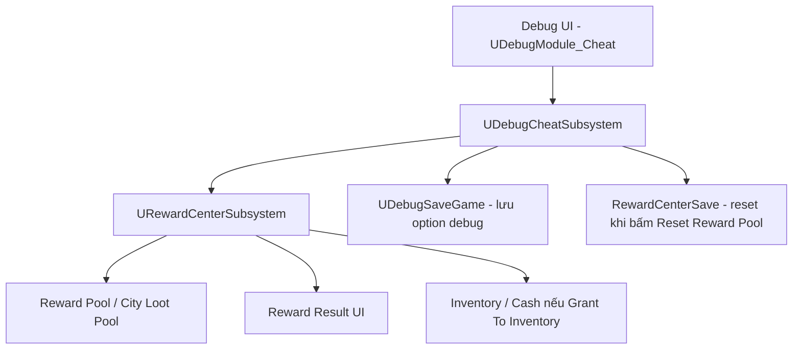
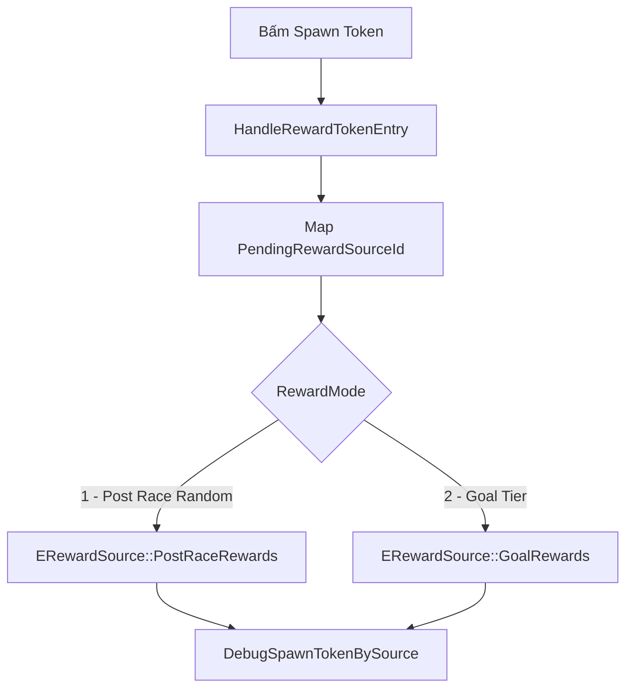
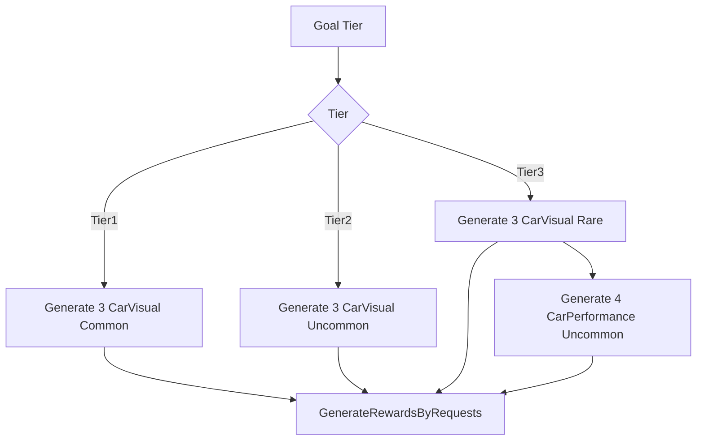
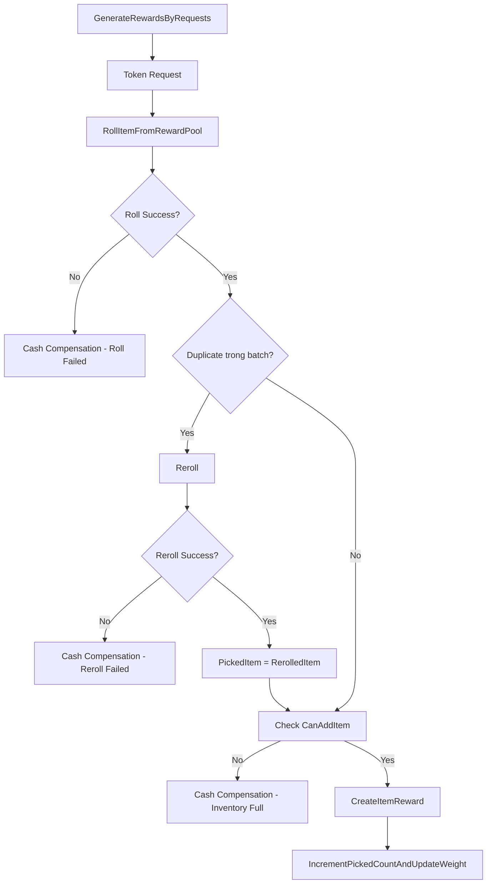
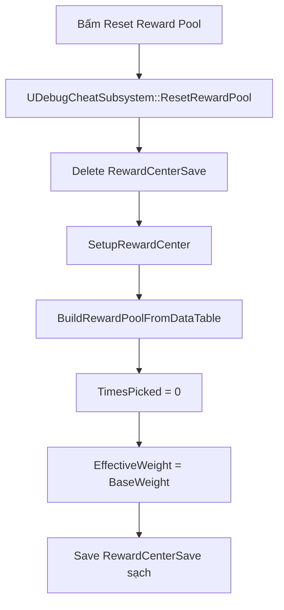

[Tài liệu_DebugSpawnToken.md](https://github.com/user-attachments/files/28693625/Tai.li.u_DebugSpawnToken.md)
# Debug Spawn Token Flow

## Mục Tiêu

Tính năng `Spawn Token` trong debug cheat dùng để QC/dev test nhanh reward item mà không cần chơi đủ flow đua thật hoặc hoàn thành goal thật.

Debug UI chỉ đóng vai trò trung gian:

- Chọn input: `CityID`, `RewardMode`, `Amount/Tier`, `Grant To Inventory`.
- Lưu lại option đã chọn vào `UDebugSaveGame`.
- Gọi sang `RewardCenterSubsystem` để chạy logic reward thật.
- Hiển thị reward UI giống flow thật.
- Có nút `Reset Reward Pool` để reset lại `TimesPicked`/`EffectiveWeight` của reward pool về trạng thái ban đầu từ data table.

Debug không tự quyết định item nào rơi. Item rơi, cash fallback, duplicate, weight decay đều đi qua `RewardCenterSubsystem`.

## Sản Phẩm Cuối

Trong cheat debug có nhóm `Rewards &tokens` với các control:

```text
CityID
RewardMode
Amount/Tier
Grant To Inventory
Spawn Token
Reset Reward Pool
```

Các option được lưu vào `Debug/DebugSaveGame`:

```cpp
PendingRewardCityId
PendingRewardSourceId
PendingRewardTokenAmount
bPendingRewardGrantToInventory
```

Kết quả mong đợi:

- Mở debug panel sẽ load lại option đã chọn trước đó.
- Option hiện tại có hậu tố `(Current)`.
- Bấm `Spawn Token` sẽ gọi reward flow thật theo mode đang chọn.
- Bật `Grant To Inventory` thì reward/cash được grant vào player data.
- Tắt `Grant To Inventory` thì chỉ preview reward UI.
- Bấm `Reset Reward Pool` sẽ reset save `RewardCenterSave`, đưa reward pool về trạng thái ban đầu từ data table.

## Cấu Trúc Tổng Quan



## Flow Build UI

Entry point:

```cpp
UDebugModule_Cheat::GetEntries()
```

File:

```text
PrototypeRacing/Source/PrototypeRacing/Private/DebugSystem/Modules/DebugModule_Cheat.cpp
```

Flow:

```text
GetEntries()
-> lấy GameInstance
-> LoadOptionRewardTokenFromSave(GameInstance)
-> build dropdown CityID
-> build dropdown RewardMode
-> build dropdown Amount/Tier
-> build checkbox Grant To Inventory
-> build button Spawn Token
-> build button Reset Reward Pool
```

Các entry chính:

```cpp
CheatRewardCityID
CheatRewardSource
CheatRewardTokenAmount
CheatRewardGrantToInventory
CheatRewardSpawnToken
CheatRewardResetPool
```

## Flow Lưu Và Load Option

Khi mở debug UI:

```text
UDebugModule_Cheat::GetEntries()
-> LoadOptionRewardTokenFromSave(GameInstance)
-> UDebugCheatSubsystem::LoadRewardTokenSelection(...)
-> đọc UDebugSaveGame
-> set lại PendingRewardCityId / SourceId / TokenAmount / GrantToInventory
```

Khi chọn option:

```text
UDebugModule_Cheat::HandleRewardTokenEntry(...)
-> update biến Pending...
-> SavePendingRewardSelection(GameInstance)
-> UDebugCheatSubsystem::SaveRewardTokenSelection(...)
-> ghi vào Debug/DebugSaveGame
```

Save debug này chỉ lưu option UI. Nó không lưu `TimesPicked`, không lưu reward pool.

## Flow Bấm Spawn Token

Entry:

```cpp
UDebugModule_Cheat::HandleRewardTokenEntry(...)
```

Khi `EntryId == CheatRewardSpawnToken`:

```text
PendingRewardCityId -> FName CityID
PendingRewardSourceId -> ERewardSource
PendingRewardTokenAmount -> TokenAmount hoặc GoalTier
bPendingRewardGrantToInventory -> toggle grant
-> UDebugCheatSubsystem::DebugSpawnTokenBySource(...)
```

Sơ đồ:



## Flow Trong DebugCheatSubsystem

Hàm chính:

```cpp
UDebugCheatSubsystem::DebugSpawnTokenBySource(
    FName CityID,
    int32 TokenAmount,
    ERewardSource RewardSource,
    bool bGrantToInventory)
```

Flow:

```text
DebugSpawnTokenBySource()
-> lấy GameInstance
-> lấy URewardCenterSubsystem
-> check IsCityLootPoolReady()
-> clamp TokenAmount từ 1 đến 3
-> nếu PostRaceRewards: GenerateRewardsRandomlyFromTokens()
-> nếu GoalRewards: CalculateGoalItemReward()
-> tạo/recreate reward widget debug
-> broadcast OnItemRewardCalculated
-> nếu Grant To Inventory: DistributeRewards()
-> broadcast OnItemRewardGranted
-> return FRewardBatchResult
```

## Mode 1: Post Race Random

Khi `RewardMode = Post Race Random`:

```text
DebugSpawnTokenBySource()
-> RewardCenter->GenerateRewardsRandomlyFromTokens(
       CityID,
       ClampedTokenAmount,
       ERewardSource::PostRaceRewards,
       Rewards)
```

Trong reward center:

```text
GenerateRewardsRandomlyFromTokens()
-> tạo TokenAmount request random type + random rarity
-> GenerateRewardsByRequests()
-> RollItemFromRewardPool()
```

Mode này dùng để test reward item kiểu post-race random, nhưng không tự tính cash post-race ranking.

## Mode 2: Goal Tier

Khi `RewardMode = Goal Tier`:

```text
DebugSpawnTokenBySource()
-> GoalTier = static_cast<ECityGoalTier>(ClampedTokenAmount)
-> RewardCenter->CalculateGoalItemReward(CityID, CityIndex, GoalTier)
```

Mapping hiện tại:

```text
Amount/Tier = 1 -> Tier1
Amount/Tier = 2 -> Tier2
Amount/Tier = 3 -> Tier3
```

Trong `CalculateGoalItemReward()`:

```text
Tier1 -> 3 CarVisual Common
Tier2 -> 3 CarVisual Uncommon
Tier3 -> 3 CarVisual Rare + 4 CarPerformance Uncommon
```

Sơ đồ:



## Flow Roll Reward Thật

Các mode cuối cùng đều đi về:

```cpp
URewardCenterSubsystem::GenerateRewardsByRequests(...)
```

Flow mỗi token:

```text
For mỗi token request:
-> xác định TargetType / TargetRarity
-> RollItemFromRewardPool()
-> nếu roll fail: CreateCashCompensationReward()
-> nếu duplicate trong batch: thử reroll
-> nếu reroll fail: CreateCashCompensationReward()
-> nếu duplicate non-stackable: CreateCashCompensationReward()
-> nếu inventory full: CreateCashCompensationReward()
-> nếu hợp lệ: CreateItemReward()
-> IncrementPickedCountAndUpdateWeight()
```

Sơ đồ:



## TimesPicked Và EffectiveWeight

Khi item roll thành công, reward center tăng `TimesPicked`:

```cpp
Item.TimesPicked++;
Item.EffectiveWeight = CalculateEffectiveWeight(Item);
```

Công thức:

```cpp
EffectiveWeight = BaseWeight * pow(DecayFactor, TimesPicked)
```

Ý nghĩa:

- Item đã rơi nhiều lần sẽ giảm xác suất rơi tiếp.
- Cơ chế này giúp reward pool đa dạng hơn khi có nhiều candidate.
- Nếu một nhóm chỉ có một candidate, item đó vẫn bị decay dần.
- Debug spawn nhiều lần cũng làm tăng `TimesPicked` vì đang gọi flow reward thật.

Lưu ý:

```text
TimesPicked được lưu trong RewardCenterSave, không nằm trong DebugSaveGame.
```

## Reset Reward Pool

Nút `Reset Reward Pool` dùng để dọn lại state reward pool sau khi debug/test nhiều lần.

Entry:

```text
CheatRewardResetPool
```

Flow:

```text
UDebugModule_Cheat::HandleRewardTokenEntry()
-> UDebugCheatSubsystem::ResetRewardPool()
-> DeleteSave("RewardCenterSave")
-> RewardCenter->SetupRewardCenter(CityLootPoolDataTable, DuplicateCompensationDataTable)
-> rebuild RewardPoolEntries từ data table
-> SaveSystem() bên SetupRewardCenter ghi lại state sạch
```

Sơ đồ:



## Vì Sao Cần Reset

Debug spawn dùng flow thật, nên khi spam debug:

```text
Spawn Token
-> roll item thành công
-> TimesPicked tăng
-> EffectiveWeight giảm
-> RewardCenterSave lưu state mới
```

Nếu QC/dev test nhiều lần, reward pool có thể bị lệch so với data ban đầu. `Reset Reward Pool` giúp đưa pool về trạng thái sạch để tiếp tục test.

## Các File Liên Quan

```text
PrototypeRacing/Source/PrototypeRacing/Private/DebugSystem/Modules/DebugModule_Cheat.cpp
PrototypeRacing/Source/PrototypeRacing/Public/DebugSystem/Modules/DebugModule_Cheat.h
PrototypeRacing/Source/PrototypeRacing/Private/DebugCheatSubsystem.cpp
PrototypeRacing/Source/PrototypeRacing/Public/DebugCheatSubsystem.h
PrototypeRacing/Source/PrototypeRacing/Private/BackendSubsystem/RewardCenterSubsystem.cpp
PrototypeRacing/Source/PrototypeRacing/Public/BackendSubsystem/RewardCenterSubsystem.h
PrototypeRacing/Source/PrototypeRacing/Public/DebugSystem/DebugSaveGame.h
```

## Phần Code Debug Cần Đọc

Phần này chỉ liệt kê code thuộc debug/cheat cho tính năng `Spawn Token`. Reward logic thật nằm ở `RewardCenterSubsystem`, không nằm trong debug.

### 1. Biến Pending Của Spawn Token

File:

```text
PrototypeRacing/Source/PrototypeRacing/Public/DebugSystem/Modules/DebugModule_Cheat.h
```

Code:

```cpp
// Spawn Token
mutable int32 PendingRewardCityId = 1;
mutable int32 PendingRewardSourceId = 1;
mutable int32 PendingRewardTokenAmount = 1;
mutable bool bPendingRewardGrantToInventory = false;
```

Ý nghĩa:

```text
PendingRewardCityId              -> City đang chọn trong debug.
PendingRewardSourceId            -> Mode đang chọn: 1 = Post Race Random, 2 = Goal Tier.
PendingRewardTokenAmount         -> Amount hoặc Tier đang chọn: 1/2/3.
bPendingRewardGrantToInventory   -> Toggle Grant To Inventory.
```

Các biến này chỉ là state tạm của debug UI. Khi QC đổi option, chúng được lưu vào `UDebugSaveGame`.

### 2. Build UI Cho Nhóm Rewards &tokens

File:

```text
PrototypeRacing/Source/PrototypeRacing/Private/DebugSystem/Modules/DebugModule_Cheat.cpp
```

Hàm:

```cpp
UDebugModule_Cheat::GetEntries()
```

Đoạn liên quan:

```cpp
LoadOptionRewardTokenFromSave(GameInstance);

const TArray<FDropBoxItem> RewardTokenAmountItems =
{
    { 1, DebugModuleCheatReward::MakeCurrentLabel(TEXT("1 / Tier 1"), PendingRewardTokenAmount == 1) },
    { 2, DebugModuleCheatReward::MakeCurrentLabel(TEXT("2 / Tier 2"), PendingRewardTokenAmount == 2) },
    { 3, DebugModuleCheatReward::MakeCurrentLabel(TEXT("3 / Tier 3"), PendingRewardTokenAmount == 3) },
};

const TArray<FDropBoxItem> RewardModeItems =
{
    { 1, DebugModuleCheatReward::MakeCurrentLabel(TEXT("Post Race Random"), PendingRewardSourceId == 1) },
    { 2, DebugModuleCheatReward::MakeCurrentLabel(TEXT("Goal Tier"), PendingRewardSourceId == 2) },
};

ItemsRewardsTokens.Add(MakeProgressionDropdown(FName(TEXT("CheatRewardCityID")), FText::FromString(TEXT("CityID")), RewardCityItems));
ItemsRewardsTokens.Add(MakeProgressionDropdown(FName(TEXT("CheatRewardSource")), FText::FromString(TEXT("RewardMode")), RewardModeItems));
ItemsRewardsTokens.Add(MakeProgressionDropdown(FName(TEXT("CheatRewardTokenAmount")), FText::FromString(TEXT("Amount/Tier")), RewardTokenAmountItems));
ItemsRewardsTokens.Add(MakeProgressionCheckBox(FName(TEXT("CheatRewardGrantToInventory")), FText::FromString(TEXT("Grant To Inventory")), bPendingRewardGrantToInventory));
ItemsRewardsTokens.Add({ TEXT("CheatRewardSpawnToken"), FText::FromString(TEXT("Spawn Token")), EDebugEntryType::Button });
ItemsRewardsTokens.Add({ TEXT("CheatRewardResetPool"), FText::FromString(TEXT("Reset Reward Pool")), EDebugEntryType::Button });
```

Ý nghĩa:

```text
LoadOptionRewardTokenFromSave()  -> mở debug UI là load lại option đã lưu.
MakeCurrentLabel()               -> thêm hậu tố (Current) cho option đang chọn.
CheatRewardSpawnToken            -> nút gọi spawn reward.
CheatRewardResetPool             -> nút reset RewardCenterSave.
```

### 3. Xử Lý Khi QC Chọn Option Hoặc Bấm Nút

File:

```text
PrototypeRacing/Source/PrototypeRacing/Private/DebugSystem/Modules/DebugModule_Cheat.cpp
```

Hàm:

```cpp
UDebugModule_Cheat::HandleRewardTokenEntry(...)
```

Entry id:

```cpp
static const FName CityEntryId(TEXT("CheatRewardCityID"));
static const FName SourceEntryId(TEXT("CheatRewardSource"));
static const FName TokenAmountEntryId(TEXT("CheatRewardTokenAmount"));
static const FName GrantEntryId(TEXT("CheatRewardGrantToInventory"));
static const FName SpawnEntryId(TEXT("CheatRewardSpawnToken"));
static const FName ResetPoolEntryId(TEXT("CheatRewardResetPool"));
```

Khi chọn `CityID`:

```cpp
PendingRewardCityId = FMath::Max(1, FMath::RoundToInt(Value.GetValue<float>()));
SavePendingRewardSelection(GI);
```

Khi chọn `RewardMode`:

```cpp
PendingRewardSourceId = FMath::RoundToInt(Value.GetValue<float>());
SavePendingRewardSelection(GI);
```

Khi chọn `Amount/Tier`:

```cpp
PendingRewardTokenAmount = FMath::Clamp(FMath::RoundToInt(Value.GetValue<float>()), 1, 3);
SavePendingRewardSelection(GI);
```

Khi bật/tắt `Grant To Inventory`:

```cpp
bPendingRewardGrantToInventory = bToggleValue;
SavePendingRewardSelection(GI);
```

Khi bấm `Spawn Token`:

```cpp
const FName CityID(*FString::FromInt(PendingRewardCityId));
const TMap<int32, ERewardSource> RewardSourceByMode =
{
    { 1, ERewardSource::PostRaceRewards },
    { 2, ERewardSource::GoalRewards },
};

const ERewardSource RewardSource = RewardSourceByMode.Contains(PendingRewardSourceId)
    ? RewardSourceByMode[PendingRewardSourceId]
    : ERewardSource::PostRaceRewards;

CheatSubsystem->DebugSpawnTokenBySource(
    CityID,
    PendingRewardTokenAmount,
    RewardSource,
    bPendingRewardGrantToInventory);
```

Khi bấm `Reset Reward Pool`:

```cpp
CheatSubsystem->ResetRewardPool();
```

### 4. Load Option Từ Debug Save

File:

```text
PrototypeRacing/Source/PrototypeRacing/Private/DebugSystem/Modules/DebugModule_Cheat.cpp
```

Hàm:

```cpp
UDebugModule_Cheat::LoadOptionRewardTokenFromSave(UGameInstance* GI) const
```

Code:

```cpp
if (const UDebugCheatSubsystem* CheatSubsystem = GI->GetSubsystem<UDebugCheatSubsystem>())
{
    CheatSubsystem->LoadRewardTokenSelection(
        PendingRewardCityId,
        PendingRewardSourceId,
        PendingRewardTokenAmount,
        bPendingRewardGrantToInventory);
}
```

Ý nghĩa:

```text
Mỗi lần mở/build debug UI sẽ load lại option từ DebugSaveGame.
Không dùng flag cache, vì yêu cầu hiện tại là cứ mở debug thì load lại save.
```

### 5. Save Option Vào Debug Save

File:

```text
PrototypeRacing/Source/PrototypeRacing/Private/DebugSystem/Modules/DebugModule_Cheat.cpp
```

Hàm:

```cpp
UDebugModule_Cheat::SavePendingRewardSelection(UGameInstance* GI) const
```

Code:

```cpp
if (const UDebugCheatSubsystem* CheatSubsystem = GI->GetSubsystem<UDebugCheatSubsystem>())
{
    CheatSubsystem->SaveRewardTokenSelection(
        PendingRewardCityId,
        PendingRewardSourceId,
        PendingRewardTokenAmount,
        bPendingRewardGrantToInventory);
}
```

Ý nghĩa:

```text
Debug module không tự ghi save.
Nó gọi UDebugCheatSubsystem để ghi option vào DebugSaveGame.
```

### 6. Hàm Load Save Trong Cheat Subsystem

File:

```text
PrototypeRacing/Source/PrototypeRacing/Private/DebugCheatSubsystem.cpp
```

Hàm:

```cpp
UDebugCheatSubsystem::LoadRewardTokenSelection(...)
```

Code:

```cpp
OutCityId = 1;
OutSourceId = 1;
OutTokenAmount = 1;
bOutGrantToInventory = false;

if (!UGameplayStatics::DoesSaveGameExist(DebugCheatSave::DebugSaveSlotName, DebugCheatSave::DebugSaveUserIndex))
{
    return;
}

const UDebugSaveGame* DebugSaveGame = Cast<UDebugSaveGame>(
    UGameplayStatics::LoadGameFromSlot(DebugCheatSave::DebugSaveSlotName, DebugCheatSave::DebugSaveUserIndex));

OutCityId = FMath::Max(1, DebugSaveGame->PendingRewardCityId);
OutSourceId = FMath::Clamp(DebugSaveGame->PendingRewardSourceId, 1, 2);
OutTokenAmount = FMath::Clamp(DebugSaveGame->PendingRewardTokenAmount, 1, 3);
bOutGrantToInventory = DebugSaveGame->bPendingRewardGrantToInventory;
```

Ý nghĩa:

```text
Nếu chưa có save thì dùng default.
Nếu có save thì load lại option đã chọn trước đó.
```

### 7. Hàm Save Trong Cheat Subsystem

File:

```text
PrototypeRacing/Source/PrototypeRacing/Private/DebugCheatSubsystem.cpp
```

Hàm:

```cpp
UDebugCheatSubsystem::SaveRewardTokenSelection(...)
```

Code:

```cpp
DebugSaveGame->PendingRewardCityId = FMath::Max(1, CityId);
DebugSaveGame->PendingRewardSourceId = FMath::Clamp(SourceId, 1, 2);
DebugSaveGame->PendingRewardTokenAmount = FMath::Clamp(TokenAmount, 1, 3);
DebugSaveGame->bPendingRewardGrantToInventory = bGrantToInventory;

DebugCheatSave::EnsureDebugSaveDirectory();
UGameplayStatics::SaveGameToSlot(
    DebugSaveGame,
    DebugCheatSave::DebugSaveSlotName,
    DebugCheatSave::DebugSaveUserIndex);
```

Ý nghĩa:

```text
Chỉ lưu option debug.
Không lưu reward result.
Không lưu RewardCenterSave.
Không lưu TimesPicked.
```

### 8. Hàm Spawn Token Chính Trong Cheat Subsystem

File:

```text
PrototypeRacing/Source/PrototypeRacing/Private/DebugCheatSubsystem.cpp
```

Hàm:

```cpp
UDebugCheatSubsystem::DebugSpawnTokenBySource(...)
```

Code rút gọn:

```cpp
URewardCenterSubsystem* const RewardCenter = GI->GetSubsystem<URewardCenterSubsystem>();

const int32 ClampedTokenAmount = FMath::Clamp(TokenAmount, 1, 3);
const int32 CityIndex = FMath::Max(0, FCString::Atoi(*CityID.ToString()) - 1);

auto GeneratePostRaceReward = [&]() -> FRewardBatchResult
{
    return RewardCenter->GenerateRewardsRandomlyFromTokens(
        CityID,
        ClampedTokenAmount,
        RewardSource,
        Rewards);
};

auto GenerateGoalReward = [&]() -> FRewardBatchResult
{
    const ECityGoalTier GoalTier = static_cast<ECityGoalTier>(ClampedTokenAmount);

    FRewardBatchResult GoalResult = RewardCenter->CalculateGoalItemReward(CityID, CityIndex, GoalTier);
    Rewards = GoalResult.Rewards;
    return GoalResult;
};
```

Dispatch theo mode:

```cpp
RewardSourceActions.Add(ERewardSource::PostRaceRewards, GeneratePostRaceReward);
RewardSourceActions.Add(ERewardSource::GoalRewards, GenerateGoalReward);
```

Sau khi có reward:

```cpp
if (BatchResult.bSuccess)
{
    RewardCenter->OnItemRewardCalculated.Broadcast(BatchResult);
}

if (bGrantToInventory && BatchResult.Rewards.Num() > 0)
{
    RewardCenter->DistributeRewards(BatchResult.Rewards);
}

if (BatchResult.bSuccess)
{
    RewardCenter->OnItemRewardGranted.Broadcast(BatchResult.Rewards);
}
```

Ý nghĩa:

```text
Debug chỉ gọi reward center.
Mode Post Race Random gọi GenerateRewardsRandomlyFromTokens().
Mode Goal Tier gọi CalculateGoalItemReward().
Nếu Grant To Inventory bật, debug gọi DistributeRewards().
```

### 9. Hàm Reset Reward Pool Trong Cheat Subsystem

File:

```text
PrototypeRacing/Source/PrototypeRacing/Private/DebugCheatSubsystem.cpp
```

Hàm:

```cpp
UDebugCheatSubsystem::ResetRewardPool()
```

Code rút gọn:

```cpp
UGameInstance* const GI = GetGameInstance();
URewardCenterSubsystem* const RewardCenter = GI->GetSubsystem<URewardCenterSubsystem>();
const URacingCarGameInstance* const RacingGI = Cast<URacingCarGameInstance>(GI);

const FString RewardCenterSaveName(TEXT("RewardCenterSave"));
UCarSaveGameManager::DeleteSave(RewardCenterSaveName, UserIndex);

RewardCenter->SetupRewardCenter(
    RacingGI->CityLootPoolDataTable,
    RacingGI->DuplicateCompensationDataTable);
```

Ý nghĩa:

```text
Xóa save RewardCenterSave.
Setup lại reward center từ data table.
RewardPoolEntries được rebuild.
TimesPicked về 0.
EffectiveWeight về BaseWeight.
```

Lưu ý:

```text
Reset Reward Pool chỉ nằm trong cheat/debug.
Game thật không tự gọi hàm này.
```

## Tóm Tắt

```text
Debug UI chọn option
-> CheatSubsystem gọi RewardCenterSubsystem
-> RewardCenterSubsystem roll reward thật
-> UI hiển thị reward result
-> nếu bật Grant To Inventory thì grant reward/cash
-> Reset Reward Pool dùng để reset TimesPicked/EffectiveWeight về data gốc
```
