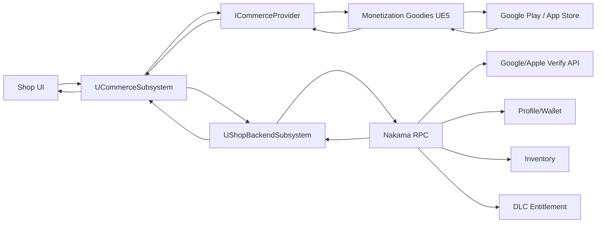
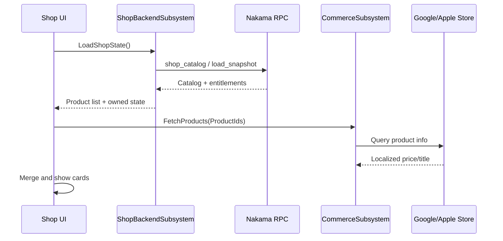
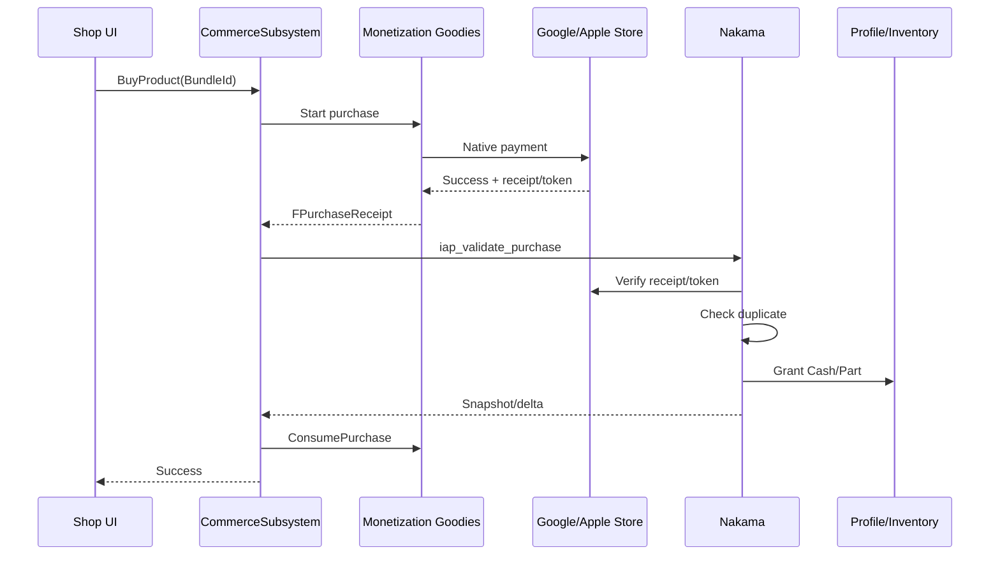
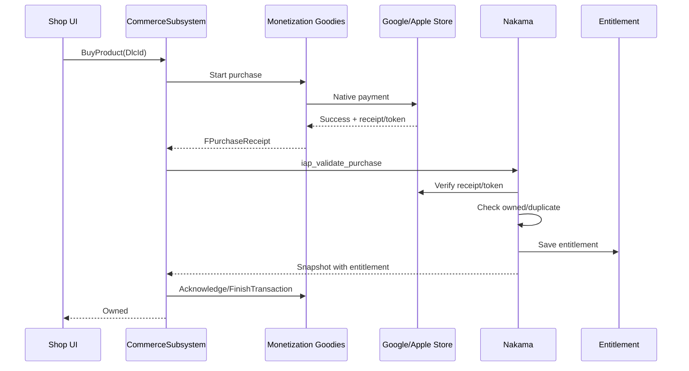

# Shop & IAP Server Payment Architecture

Ngày tạo: 13/06/2026  
Phạm vi: kiến trúc Shop thanh toán qua Google Play/App Store, dùng Monetization Goodies UE5 ở client và Nakama làm server validate/grant.

## 1. Mục tiêu

Shop phải chạy theo nguyên tắc:

```text
Client mở thanh toán
Store xử lý tiền
Nakama verify giao dịch
Nakama grant reward/entitlement
Client chỉ sync kết quả server trả về
```

Client không tự cộng Cash, không tự add item, không tự unlock DLC.

## 2. Các tính năng con chính

1. **Shop Catalog & Product Definition**
   - Product ID, tên, giá tham chiếu, loại product, reward mapping.
   - Bundle là consumable.
   - DLC là non-consumable.

2. **Android/iOS Store Configuration**
   - Tạo product trên Google Play Console/App Store Connect.
   - Cấu hình package name/bundle ID, sandbox tester, signing, backend credential verify.

3. **Shop UI & Entry Point**
   - Mở Shop từ các màn hình.
   - Hiển thị tab, card, popup mua hàng, trạng thái `Owned`.

4. **Commerce Layer**
   - `UCommerceSubsystem`.
   - `ICommerceProvider`.
   - `FMockCommerceProvider`.
   - `FMonetizationGoodiesCommerceProvider`.

5. **Store Payment Integration**
   - Query giá thật.
   - Mở payment native.
   - Nhận receipt/token.
   - Consume/Acknowledge transaction.

6. **Server Validation**
   - Nakama RPC nhận receipt/token.
   - Nakama verify với Google Play/App Store.
   - Check duplicate transaction.

7. **Reward, Inventory & Entitlement**
   - Server grant Cash/item.
   - Server unlock DLC.
   - Server trả snapshot/delta.
   - Client apply vào Profile/Inventory/Shop state.

8. **Restore, Recovery, Analytics & QA**
   - Load owned state khi mở Shop.
   - Restore DLC khi cần recovery.
   - Retry pending receipt.
   - Log và test các case thanh toán.

## 3. Phân rã task theo phần tính năng

Phần này dùng để đưa lên task board. Mỗi nhóm bên dưới là một epic lớn.

### SHOP-01 - Catalog & Product Definition

Mục tiêu: server, client và store dùng cùng một định nghĩa product.

Việc cần làm:

- [ ] Chốt danh sách product cuối cùng.
- [ ] Chốt product ID nội bộ.
- [ ] Chốt Android product ID.
- [ ] Chốt iOS product ID.
- [ ] Chốt type: consumable hoặc non-consumable.
- [ ] Chốt category: `DLC`, `BOOSTER_BUNDLES`.
- [ ] Chốt reward mapping cho từng product.
- [ ] Chốt entitlement key cho từng DLC.
- [ ] Sửa ID trùng `DLC_CAR_SP02` thành `DLC_CAR_SP03` hoặc ID chính thức khác.
- [ ] Đối chiếu `DT_IAP_Shop` với catalog đã chốt.
- [ ] Bổ sung field còn thiếu trong `FShopRowInfo` nếu cần: platform product id, product type, category, entitlement key.
- [ ] Tạo server authoritative catalog trong Nakama.

Đầu ra:

- Bảng catalog chuẩn.
- Data table client khớp server catalog.
- Không còn product thiếu, sai reward hoặc trùng ID.

### SHOP-02 - Android/iOS Store Configuration

Mục tiêu: product tồn tại trên store thật và server có thể verify giao dịch.

Việc cần làm Android:

- [ ] Kiểm tra package name Android hiện tại.
- [ ] Tạo app trên Google Play Console đúng package name.
- [ ] Upload build lên internal/closed testing.
- [ ] Tạo in-app product cho từng Bundle/DLC.
- [ ] Set Bundle là consumable.
- [ ] Set DLC là non-consumable.
- [ ] Set title/description/price.
- [ ] Activate products.
- [ ] Thêm license tester/sandbox tester.
- [ ] Tạo Google service account.
- [ ] Gán quyền verify purchase.
- [ ] Lưu service account JSON ở server/secret manager.
- [ ] Config package name và product mapping trong Nakama.

Việc cần làm iOS:

- [ ] Kiểm tra Bundle ID iOS hiện tại.
- [ ] Tạo app trên App Store Connect đúng Bundle ID.
- [ ] Tạo IAP product cho từng Bundle/DLC.
- [ ] Set Bundle là consumable.
- [ ] Set DLC là non-consumable.
- [ ] Set localization/title/description/price.
- [ ] Tạo sandbox tester.
- [ ] Cấu hình signing certificate.
- [ ] Cấu hình provisioning profile.
- [ ] Upload TestFlight hoặc build sandbox theo workflow team.
- [ ] Cấu hình Apple credential/secret/private key ở server.
- [ ] Config Bundle ID, environment và product mapping trong Nakama.

Đầu ra:

- Store trả được product info.
- Store trả được purchase result.
- Nakama có credential để verify Android/iOS.

### SHOP-03 - Shop UI & Entry Point

Mục tiêu: player mở Shop, xem product, thấy đúng owned state và thao tác mua.

Việc cần làm:

- [ ] Kiểm tra entry point mở Shop từ các màn hình cần hỗ trợ.
- [ ] Khi mở Shop, gọi flow load catalog + owned state.
- [ ] Render tab `DLC`.
- [ ] Render tab `BOOSTER_BUNDLES`.
- [ ] Render card từ catalog/data.
- [ ] Hiển thị title, description, icon, reward summary.
- [ ] Hiển thị giá store sau `QueryProducts`.
- [ ] Hiển thị fallback price/title khi query chưa xong.
- [ ] DLC đã owned hiển thị `Owned`.
- [ ] DLC đã owned không cho mua lại.
- [ ] Bundle vẫn cho mua lại.
- [ ] Popup xác nhận mua có `Cancel` và `Buy`.
- [ ] Ẩn hoặc disable `Buy As A Gift` nếu Gift chưa triển khai.
- [ ] UI state: loading, purchasing, validating, success, failed, cancelled, pending, owned.

Đầu ra:

- Shop UI chạy được với catalog.
- Player biết product nào đã mua ngay khi mở Shop.

### SHOP-04 - Client Commerce Layer

Mục tiêu: gom toàn bộ logic payment client vào một lớp điều phối.

Việc cần làm:

- [ ] Mở rộng `FProductInfo` nếu cần thêm description/currency/localized price.
- [ ] Tạo `FPurchaseReceipt`.
- [ ] Sửa `FOnPurchaseComplete` để trả `FPurchaseReceipt` thay vì chỉ `ProductId`.
- [ ] Sửa `FOnCommercePurchaseFinished` để Blueprint nhận receipt hoặc trạng thái validate.
- [ ] Mở rộng `ICommerceProvider`:
  - `QueryProducts`
  - `PurchaseProduct`
  - `RestorePurchases`
  - `ConsumePurchase`
  - `AcknowledgePurchase` hoặc `FinishTransaction`
- [ ] Cập nhật `UCommerceSubsystem` state machine.
- [ ] Chặn transaction song song.
- [ ] Thêm pending receipt storage/retry.
- [ ] Tạo `UShopBackendSubsystem`.
- [ ] `CommerceSubsystem` gọi `ShopBackendSubsystem` sau store success.

Đầu ra:

- UI chỉ gọi `CommerceSubsystem`.
- Client không có đường tự grant reward.
- Receipt/token đi qua server trước khi consume/ack.

### SHOP-05 - Commerce Providers & Store Integration

Mục tiêu: có provider mock để test Editor và provider thật cho Android/iOS.

Việc cần làm `FMockCommerceProvider`:

- [ ] Implement `QueryProducts` trả product info mock.
- [ ] Purchase mock trả `FPurchaseReceipt` mock.
- [ ] Thêm mode success/cancel/failed/pending.
- [ ] Mock restore trả danh sách DLC đã mua giả.
- [ ] Mock consume/ack để test flow.

Việc cần làm `FMonetizationGoodiesCommerceProvider`:

- [ ] Bọc API Monetization Goodies UE5.
- [ ] Implement query product thật.
- [ ] Implement buy product thật.
- [ ] Map Android purchase token/order id vào `FPurchaseReceipt`.
- [ ] Map iOS transaction/receipt vào `FPurchaseReceipt`.
- [ ] Implement restore purchases.
- [ ] Implement consume Bundle.
- [ ] Implement acknowledge/finish DLC.
- [ ] Handle callback success/cancel/failed/pending.

Đầu ra:

- Editor test được end-to-end bằng mock.
- Android/iOS dùng store thật qua Monetization Goodies.

### SHOP-06 - Nakama Server Validation

Mục tiêu: Nakama là nơi xác nhận giao dịch và quyết định grant.

Việc cần làm:

- [ ] Tạo RPC `shop_catalog`.
- [ ] Tạo RPC `iap_validate_purchase`.
- [ ] Tạo RPC `iap_restore_purchases`.
- [ ] Tạo storage `shop_catalog`.
- [ ] Tạo storage `iap_transactions`.
- [ ] Tạo storage `player_entitlements`.
- [ ] Implement verify Google Play purchase token.
- [ ] Implement verify Apple receipt/transaction.
- [ ] Check product ID hợp lệ theo server catalog.
- [ ] Check package name/bundle ID đúng.
- [ ] Check purchase state hợp lệ.
- [ ] Check duplicate transaction.
- [ ] Return `already_processed` nếu retry giao dịch đã grant.
- [ ] Return `already_owned` nếu DLC đã owned.
- [ ] Reject receipt giả/product ID giả.

Đầu ra:

- Server không tin dữ liệu reward từ client.
- Mọi giao dịch IAP được verify và idempotent.

### SHOP-07 - Reward, Inventory & Entitlement

Mục tiêu: sau khi validate, server grant đúng và client sync đúng.

Việc cần làm:

- [ ] Grant Cash Bundle vào wallet/profile server.
- [ ] Grant Performance Bundle: Cash + Performance Part từ shop pool.
- [ ] Grant DLC Map: entitlement + unlock city/car.
- [ ] Grant DLC Visual: entitlement + visual part/material.
- [ ] Grant DLC Car: entitlement + special car.
- [ ] Mở rộng snapshot để có DLC entitlements.
- [ ] Client parse entitlement trong snapshot.
- [ ] Shop UI dùng entitlement để hiện `Owned`.
- [ ] Inventory chỉ nhận item từ snapshot/server result, không grant local.
- [ ] Kiểm tra `InventoryManager::CanAddItem` với non-stackable shop item.
- [ ] Kiểm tra RewardCenter nếu tái dùng grant logic cho IAP.

Đầu ra:

- Cash/item/DLC đồng bộ qua server snapshot.
- Không bị grant trùng hoặc lệch local/server.

### SHOP-08 - Restore, Recovery, Analytics & QA

Mục tiêu: không mất hàng, không grant trùng, có log để support.

Việc cần làm:

- [ ] Khi mở Shop, load owned state từ server snapshot/entitlement.
- [ ] Restore chỉ dùng như recovery cho DLC/non-consumable.
- [ ] Implement restore flow client -> store -> Nakama.
- [ ] Implement pending receipt retry khi server timeout.
- [ ] Retry pending receipt khi app mở lại hoặc có mạng.
- [ ] Không consume/ack nếu server chưa grant.
- [ ] Log `shop_open`.
- [ ] Log `purchase_started`.
- [ ] Log `purchase_store_success`.
- [ ] Log `purchase_validate_success`.
- [ ] Log `purchase_granted`.
- [ ] Log `purchase_failed`.
- [ ] Log `purchase_cancelled`.
- [ ] Log `restore_started`.
- [ ] Log `restore_finished`.
- [ ] QA Android sandbox.
- [ ] QA iOS sandbox.
- [ ] Test fake receipt/product ID.
- [ ] Test duplicate callback.
- [ ] Test app kill sau store success.

Đầu ra:

- Player không mất hàng khi store đã charge.
- Support có transaction log để tra cứu.

## 4. Hiện trạng code hiện tại

Phần này ghi nhận theo source hiện có trong project `PrototypeRacing`.

### Đã có

- Có module `IAPSystem`.
- Có `ICommerceProvider` tại `Source/PrototypeRacing/Public/IAPSystem/CommerceProvider.h`.
- Có `UCommerceSubsystem` tại `Source/PrototypeRacing/Public/IAPSystem/CommerceSubsystem.h`.
- Có `FMockCommerceProvider` tại `Source/PrototypeRacing/Public/IAPSystem/MockCommerceProvider.h`.
- Có `FProductInfo`, `ECommerceResult`, `FShopReward`, `FShopRowInfo`.
- `UCommerceSubsystem` đã chọn provider theo platform nhưng Android/iOS hiện vẫn dùng mock.
- `UCommerceSubsystem::FetchProducts` đã gọi `ActiveProvider->QueryProducts`.
- `UCommerceSubsystem::BuyProduct` đã gọi `ActiveProvider->PurchaseProduct`.
- Có guard `bIsProcessingTransaction` để chặn transaction song song cơ bản.
- `FMockCommerceProvider::PurchaseProduct` đã giả lập success sau 1.5 giây.
- Có asset/data Shop như `DT_IAP_Shop`, `WBP_Shop`, card DLC/Booster trong Content.
- Android config đã bật Google Play support và IAP cơ bản:
  - `bEnableGooglePlaySupport=true`
  - `bSupportsInAppPurchasing=true`
  - permission `com.android.vending.BILLING`
- iOS config đã bật IAP cơ bản:
  - `bSupportsInAppPurchasing=true`
  - `bUseStoreV2=true`
- `PrototypeRacing.Build.cs` đã có `NakamaUnreal`, `Json`, `JsonUtilities`.
- `PrototypeRacing.Build.cs` đã dynamic load:
  - `OnlineSubsystemGooglePlay` cho Android
  - `OnlineSubsystemIOS` cho iOS
- Có `UNakamaServiceSubsystem` để tạo Nakama client, login, giữ session và realtime client.
- Có `USnapshotAdapterSubsystem` tự gọi RPC `load_snapshot` sau khi auth success.
- Snapshot hiện apply vào:
  - `UProfileManagerSubsystem`
  - `UProgressionSubsystem`
  - `UInventoryManager`
- `UInventoryManager` đã có `ApplyFromSnapshot`.
- `UInventoryManager` có `bUseBackendAuthority`; khi bật backend authority sẽ block local mutation không phải `BackendSync` hoặc `default`.

### Chưa có hoặc chưa đủ

- Chưa có `FPurchaseReceipt`.
- Purchase callback hiện chỉ trả `ProductId`, chưa trả receipt/token/transaction id.
- `FMockCommerceProvider::QueryProducts` đang rỗng.
- `FMockCommerceProvider` chưa mock cancel/failed/pending.
- `FMockCommerceProvider` chưa mock restore/consume/ack.
- Chưa có `FMonetizationGoodiesCommerceProvider`.
- Chưa tích hợp Monetization Goodies UE5 trong provider thật.
- Android/iOS runtime hiện vẫn chọn `FMockCommerceProvider`.
- `ICommerceProvider` chưa có API:
  - `RestorePurchases`
  - `ConsumePurchase`
  - `AcknowledgePurchase` hoặc `FinishTransaction`
- `UCommerceSubsystem` chưa gọi server validate sau purchase success.
- Chưa có `UShopBackendSubsystem`.
- Chưa có pending receipt retry.
- Chưa có RPC Shop/IAP:
  - `shop_catalog`
  - `iap_validate_purchase`
  - `iap_restore_purchases`
- Chưa có storage server:
  - `shop_catalog`
  - `iap_transactions`
  - `player_entitlements`
- Snapshot hiện chưa có DLC entitlement field.
- Shop UI chưa có confirmed flow load owned state từ entitlement.
- Chưa có Google/Apple receipt verification server-side.
- Chưa có transaction idempotency cho IAP.
- Chưa có consume/ack sau server grant.

## 5. Nakama hiện tại đã tới đâu?

### Client Nakama đã có

- `UNakamaServiceSubsystem` tạo `UNakamaClient` bằng `UNakamaClient::CreateDefaultClient`.
- Có login bằng email, username và device ID.
- Mobile non-editor tự login device ID.
- Có session cache qua `GetSession`.
- Có realtime client setup.
- Có delegate `AuthLoginSuccess`.
- `USnapshotAdapterSubsystem` bind vào `AuthLoginSuccess`.
- Sau login, `USnapshotAdapterSubsystem` gọi:

```text
RPC: load_snapshot
Payload: {}
```

- Khi RPC success, client parse `FSnapshotResponse`.
- Snapshot apply vào Profile/Progression/Inventory.

### Server/Nakama Shop-IAP chưa có

Hiện code client chưa thấy các RPC Shop/IAP:

```text
shop_catalog
iap_validate_purchase
iap_restore_purchases
```

Hiện snapshot model chưa thấy entitlement:

```text
player_entitlements
DLC owned state
IAP transaction state
```

Vì vậy phần Nakama hiện tại có thể tái dùng:

- Nakama connection/session.
- Pattern gọi RPC.
- Pattern parse payload JSON.
- Pattern apply snapshot.
- Backend authority mode của Inventory.

Nhưng vẫn cần viết mới:

- `UShopBackendSubsystem` phía client.
- RPC Shop/IAP phía server.
- Storage transaction/entitlement.
- Mở rộng snapshot để Shop biết DLC owned.

## 6. Monetization Goodies UE5 là gì?

`Monetization Goodies UE5` là plugin giúp Unreal gọi hệ thống thanh toán native của Google Play và App Store.

Plugin này dùng để:

- Query product từ store.
- Lấy giá localized.
- Mở màn hình thanh toán Google Play/App Store.
- Nhận purchase result.
- Lấy receipt/token giao dịch.
- Restore purchase cho DLC/non-consumable.
- Consume Bundle.
- Acknowledge/finish DLC.

Vai trò của nó:

```text
CommerceSubsystem
-> ICommerceProvider
-> Monetization Goodies UE5
-> Google Play / App Store
```

Nó không thay thế server. Monetization Goodies chỉ giúp client nói chuyện với store. Nakama vẫn phải verify giao dịch và grant reward.

## 7. Store native là gì?

`Store native` là hệ thống thanh toán chính chủ của từng nền tảng:

- Android: Google Play Billing.
- iOS: Apple In-App Purchase.

Game không tự vẽ form nhập thẻ và không tự trừ tiền. Game gọi store native, store hiện UI thanh toán chính thức, xử lý tiền và trả kết quả giao dịch.

## 8. Sơ đồ kiến trúc



## 9. Flow mua hàng gom gọn

Flow mua hàng nên hiểu theo 6 bước:

```text
1. Player chọn mua trong Shop
2. Client mở thanh toán store
3. Store trả kết quả giao dịch
4. Server validate giao dịch
5. Server cấp hàng và đồng bộ dữ liệu
6. Client hoàn tất transaction với store
```

Chi tiết:

| Bước | Diễn giải |
| --- | --- |
| 1. Player chọn mua | UI gọi `CommerceSubsystem.BuyProduct(ProductId)`. |
| 2. Client mở store payment | `CommerceSubsystem -> ICommerceProvider -> Monetization Goodies -> Google/Apple Store`. |
| 3. Store trả kết quả | Nếu success, store trả receipt/token/transaction ID. Nếu cancel/fail thì dừng flow. |
| 4. Server validate | Client gửi receipt/token lên Nakama RPC. Nakama hỏi Google/Apple để xác nhận giao dịch thật. |
| 5. Server grant + sync | Nakama check duplicate, grant reward/entitlement, trả snapshot/delta. |
| 6. Client finalize | Bundle thì `consume`, DLC thì `acknowledge/finish`, UI hiển thị `Success/Owned`. |

Flow gọn:

```text
Player Buy
-> Client mở store payment
-> Store trả receipt/token
-> Nakama verify receipt/token với Google/Apple
-> Nakama grant + trả snapshot
-> Client consume/ack + UI success
```

## 10. Server validate receipt/token là gì?

`Server` ở đây là Nakama backend mình viết.

Nakama nhận receipt/token từ client, rồi gọi API Google/Apple để xác nhận:

### Android

```text
Client gửi purchaseToken
-> Nakama gọi Google Play Developer API
-> Google xác nhận:
   - token có thật không
   - đúng package name không
   - đúng product ID không
   - purchase state hợp lệ không
```

### iOS

```text
Client gửi receiptData / transactionId
-> Nakama gọi Apple verify API
-> Apple xác nhận:
   - receipt/transaction có thật không
   - đúng bundle ID không
   - đúng product ID không
   - giao dịch đã thanh toán chưa
```

Không verify ở client vì client có thể bị cheat hoặc fake response.

## 11. Receipt/token gồm gì?

Sau khi store trả success, client nhận được bằng chứng giao dịch.

Thường gồm:

```text
ProductId
TransactionId
PurchaseToken
ReceiptData
OrderId
PurchaseState
```

Android thường cần:

```text
productId
purchaseToken
orderId
purchaseState
```

iOS thường cần:

```text
productId
transactionId
receiptData hoặc signedTransaction
```

Server dùng dữ liệu này để verify trước khi grant.

## 12. Commerce Provider

`ICommerceProvider` là interface/lớp cha trừu tượng cho thanh toán.

Trong project chốt có 2 provider:

```text
ICommerceProvider
├─ FMockCommerceProvider
└─ FMonetizationGoodiesCommerceProvider
```

### `FMockCommerceProvider`

Dùng trong Editor/dev:

- Không gọi Google Play/App Store thật.
- Giả lập query product.
- Giả lập purchase success/fail/cancel/pending.
- Tạo receipt giả.
- Dùng để test UI, Nakama mock validate và grant reward.

### `FMonetizationGoodiesCommerceProvider`

Dùng trên Android/iOS thật:

- Bọc Monetization Goodies UE5.
- Query giá thật từ store.
- Mở payment native.
- Nhận receipt/token thật.
- Restore DLC.
- Consume Bundle.
- Acknowledge/finish DLC.

Không cần tách `FGooglePlayCommerceProvider` và `FAppleCommerceProvider` nếu Monetization Goodies xử lý được cả Android và iOS.

## 13. API của `ICommerceProvider`

```cpp
class ICommerceProvider
{
public:
	virtual ~ICommerceProvider() = default;

	virtual void QueryProducts(const TArray<FString>& ProductIds) = 0;
	virtual void BuyProduct(const FString& ProductId) = 0;
	virtual void RestorePurchases() = 0;
	virtual void ConsumePurchase(const FPurchaseReceipt& Receipt) = 0;
	virtual void AcknowledgePurchase(const FPurchaseReceipt& Receipt) = 0;
};
```

Ý nghĩa:

| API | Dùng để làm gì |
| --- | --- |
| `QueryProducts` | Lấy tên/giá product từ store. |
| `BuyProduct` | Bắt đầu thanh toán. |
| `RestorePurchases` | Lấy lại DLC/non-consumable đã mua từ store. |
| `ConsumePurchase` | Hoàn tất Bundle để user có thể mua lại. |
| `AcknowledgePurchase` | Hoàn tất DLC nhưng vẫn giữ ownership vĩnh viễn. |

## 14. Load Shop khi mở màn hình

Khi mở Shop, phải biết ngay product nào đã mua rồi.

Flow đúng:

```text
Open Shop
-> Load catalog + player entitlements từ Nakama
-> Query giá thật từ store
-> Merge data
-> Hiển thị product, giá, trạng thái Owned
```

Sơ đồ:



`RestorePurchases` không phải cách chính để biết owned khi mở Shop. Owned state chính lấy từ server entitlement.

## 15. Restore dùng khi nào?

Restore gồm 2 phần:

```text
Store restore
-> hỏi Google/Apple user đã mua non-consumable nào

Server sync
-> gửi receipt/token restore lên Nakama để verify và lưu entitlement
```

Restore dùng khi:

- User đổi máy.
- User cài lại game.
- Server chưa có entitlement nhưng store báo user đã mua.
- Cần recovery sau lỗi đồng bộ.

Restore không dùng cho Bundle vì Bundle là consumable.

Flow Restore:

```text
Player bấm Restore
-> Client gọi Monetization Goodies RestorePurchases
-> Store trả danh sách DLC đã mua
-> Client gửi receipts lên Nakama
-> Nakama verify lại
-> Nakama sync entitlement
-> Client reload Shop, DLC hiện Owned
```

## 16. Flow mua Bundle



Bundle phải `consume` sau khi server grant để user mua lại được.

## 17. Flow mua DLC



DLC không consume vì DLC là non-consumable, mua một lần và sở hữu vĩnh viễn.

## 18. Các case thanh toán

| Case | Store result | Server validate | Client xử lý | Grant |
| --- | --- | --- | --- | --- |
| Thành công | Success | Success | Apply snapshot, consume/ack | Có |
| Player hủy | Cancelled | Không gọi server | Show cancelled | Không |
| Payment fail | Failed | Không gọi server | Show failed | Không |
| Payment pending | Pending | Chưa validate/grant | Show pending | Chưa |
| Store success, server reject | Success | Reject | Show failed/support message | Không |
| Store success, server timeout | Success | Không rõ | Lưu pending receipt, retry | Chưa |
| Duplicate callback | Success lại | Already processed | Trả snapshot/result cũ | Không thêm |
| Mua lại Bundle | Success | Success nếu receipt mới | Consume sau grant | Có |
| Mua lại DLC | Store chặn hoặc server already owned | Already owned | Show Owned | Không thêm |
| Receipt giả | Có payload giả | Reject | Show failed | Không |

## 19. Pending receipt retry

Case quan trọng:

```text
Store đã charge tiền
-> Client gửi Nakama validate
-> Mạng/server timeout
```

Xử lý:

```text
1. Client lưu receipt/token vào pending validation.
2. Client chưa consume/ack.
3. Khi mở app lại hoặc có mạng, gửi lại receipt/token.
4. Nakama verify và grant.
5. Client consume/ack sau khi server success.
```

Nếu không làm bước này, có thể xảy ra mất hàng sau khi user đã bị charge.

## 20. Android config theo bước

### 20.1. Unreal/project

1. Enable Android platform.
2. Enable Monetization Goodies UE5 plugin.
3. Enable Google Play support.
4. Enable Android in-app purchase/billing theo yêu cầu plugin.
5. Set package name, ví dụ:

```text
com.company.vnracing
```

6. Package name phải khớp Google Play Console.
7. Tạo signing keystore.
8. Build APK/AAB bằng đúng package name và signing.
9. Upload build lên Google Play internal/closed testing.

### 20.2. Google Play Console

1. Tạo app đúng package name.
2. Upload build lên testing track.
3. Tạo in-app products.
4. Product ID phải khớp catalog.
5. Set product type:

```text
Bundle_* -> consumable
DLC_*    -> non-consumable
```

6. Set title/description/price.
7. Activate products.
8. Thêm license tester/sandbox tester.
9. Tester phải cài build từ Google Play testing track.
10. Hoàn tất payment profile/tax/banking nếu Google yêu cầu.

### 20.3. Monetization Goodies Android

1. Bật plugin cho Android.
2. Query product trả đúng giá.
3. BuyProduct mở Google Play payment.
4. Callback trả success/cancel/failed/pending.
5. Plugin trả được:

```text
product_id
purchase_token
order_id
purchase_state
```

6. Test `ConsumePurchase` cho Bundle.
7. Test `AcknowledgePurchase` cho DLC.

### 20.4. Nakama/backend Android

1. Tạo Google Cloud service account.
2. Gán quyền verify Google Play purchases.
3. Lưu credential JSON ở server/secret manager.
4. Config package name Android.
5. Config product ID mapping Android.
6. Implement Google Play Developer API verify.
7. Verify:

```text
package_name đúng
product_id đúng
purchase_token hợp lệ
purchase_state hợp lệ
transaction chưa grant
```

Không đưa Google credential vào client.

## 21. iOS config theo bước

### 21.1. Unreal/project

1. Enable iOS platform.
2. Enable Monetization Goodies UE5 plugin.
3. Enable iOS in-app purchase theo yêu cầu plugin.
4. Set Bundle ID, ví dụ:

```text
com.company.vnracing
```

5. Bundle ID phải khớp App Store Connect.
6. Cấu hình signing certificate.
7. Cấu hình provisioning profile.
8. Build iOS bằng đúng signing/provisioning.
9. Upload TestFlight hoặc dùng sandbox-capable build theo workflow team.

### 21.2. App Store Connect

1. Tạo app đúng Bundle ID.
2. Tạo In-App Purchases.
3. Product ID phải khớp catalog.
4. Set product type:

```text
Bundle_* -> consumable
DLC_*    -> non-consumable
```

5. Set localization/title/description/price.
6. Đưa IAP vào trạng thái sẵn sàng test.
7. Tạo sandbox tester.
8. Tester đăng nhập sandbox account trên device.
9. Hoàn tất agreements/tax/banking nếu Apple yêu cầu.

### 21.3. Monetization Goodies iOS

1. Bật plugin cho iOS.
2. Query product trả đúng giá.
3. BuyProduct mở App Store payment.
4. Callback trả success/cancel/failed/pending.
5. Plugin trả được:

```text
product_id
transaction_id
receipt_data hoặc signed_transaction
```

6. Test `RestorePurchases` cho DLC.
7. Test `FinishTransaction` hoặc equivalent sau server grant.

### 21.4. Nakama/backend iOS

1. Chọn API verify Apple theo dữ liệu plugin trả về.
2. Config Bundle ID iOS.
3. Config environment:

```text
sandbox
production
```

4. Config Apple credential/secret/private key trên server.
5. Config product ID mapping iOS.
6. Implement Apple receipt/transaction verify.
7. Verify:

```text
bundle_id đúng
product_id đúng
transaction_id hợp lệ
receipt/transaction hợp lệ
environment đúng
transaction chưa grant
```

Không đưa Apple secret/private key vào client.

## 22. Nakama RPC cần viết

RPC là hàm server-side mình tự viết trong Nakama.

### `shop_catalog`

Dùng khi mở Shop:

- Trả product catalog.
- Trả entitlement/owned state của player.
- Có thể trả reward mapping server-authoritative.

### `iap_validate_purchase`

Dùng sau khi store trả success:

- Nhận receipt/token.
- Verify với Google/Apple.
- Check duplicate.
- Grant reward/entitlement.
- Trả snapshot/delta.

### `iap_restore_purchases`

Dùng khi player bấm Restore:

- Nhận danh sách restored receipts.
- Verify từng receipt.
- Sync entitlement.
- Trả snapshot/delta.

## 23. Server storage cần có

### `shop_catalog`

Lưu:

- Product ID.
- Android/iOS product ID.
- Product type.
- Category.
- Reward list.
- Entitlement key.
- Purchase limit.

### `iap_transactions`

Lưu để chống grant trùng:

- User ID.
- Product ID.
- Platform.
- Transaction ID.
- Purchase token hash.
- Order ID.
- Status.
- Granted time.

### `player_entitlements`

Lưu DLC ownership:

- User ID.
- Entitlement key.
- Product ID.
- Source transaction.
- Granted time.

## 24. Ảnh hưởng tới hệ thống khác

### Profile/Wallet

Ảnh hưởng:

- Cash Bundle và Performance Bundle cộng Cash.
- Cash balance phải theo server snapshot.

Tính năng liên quan:

- Upgrade xe.
- Mua/nâng cấp item bằng Cash.
- Economy balancing.

### Inventory

Ảnh hưởng:

- Performance Bundle cấp Performance Part.
- DLC Visual cấp visual part/material.
- Shop performance pool không dùng chung sai với gameplay reward pool.

Tính năng liên quan:

- Car performance upgrade.
- Car visual customization.
- RewardCenter nếu dùng chung grant pipeline.

### Entitlement/DLC Ownership

Ảnh hưởng:

- DLC Map/Visual/Car cần ownership server.
- Shop dùng ownership để hiện `Owned`.
- Gameplay dùng ownership để unlock content.

Tính năng liên quan:

- VnTourMap.
- Garage.
- CarCustomize.
- Login snapshot.
- Cross-device ownership.

### Progression/Map/Garage

Ảnh hưởng:

- `DLC_MAP_ALL` unlock city/car.
- `DLC_CAR_*` unlock special car.
- Cần phân biệt unlock do progression và unlock do DLC.

## 25. Code ví dụ

### `FPurchaseReceipt`

```cpp
USTRUCT(BlueprintType)
struct FPurchaseReceipt
{
	GENERATED_BODY()

	UPROPERTY(BlueprintReadOnly)
	FString ProductId;

	UPROPERTY(BlueprintReadOnly)
	FString Platform;

	UPROPERTY(BlueprintReadOnly)
	FString TransactionId;

	UPROPERTY(BlueprintReadOnly)
	FString PurchaseToken;

	UPROPERTY(BlueprintReadOnly)
	FString ReceiptData;

	UPROPERTY(BlueprintReadOnly)
	FString OrderId;

	UPROPERTY(BlueprintReadOnly)
	bool bIsRestored = false;
};
```

### Chọn provider

```cpp
void UCommerceSubsystem::Initialize(FSubsystemCollectionBase& Collection)
{
	Super::Initialize(Collection);

#if WITH_EDITOR
	Provider = MakeUnique<FMockCommerceProvider>();
#else
	Provider = MakeUnique<FMonetizationGoodiesCommerceProvider>();
#endif
}
```

### UI gọi mua

```cpp
void UCommerceSubsystem::BuyProduct(const FString& ProductId)
{
	if (!Provider || bIsProcessingTransaction)
	{
		return;
	}

	bIsProcessingTransaction = true;
	Provider->BuyProduct(ProductId);
}
```

### Sau store success

```cpp
void UCommerceSubsystem::HandleStorePurchaseSuccess(const FPurchaseReceipt& Receipt)
{
	// Không grant ở đây.
	UShopBackendSubsystem* ShopBackend = GetGameInstance()->GetSubsystem<UShopBackendSubsystem>();
	ShopBackend->ValidatePurchase(Receipt);
}
```

### Sau server validate success

```cpp
void UCommerceSubsystem::HandleServerValidateSuccess(
	const FPurchaseReceipt& Receipt,
	bool bIsConsumable)
{
	if (bIsConsumable)
	{
		Provider->ConsumePurchase(Receipt);
	}
	else
	{
		Provider->AcknowledgePurchase(Receipt);
	}

	bIsProcessingTransaction = false;
}
```

## 26. Thứ tự triển khai

1. Chốt catalog, product ID và reward mapping.
2. Config Android Google Play.
3. Config iOS App Store Connect.
4. Tạo `FPurchaseReceipt`.
5. Tạo `ICommerceProvider`.
6. Tạo `FMockCommerceProvider`.
7. Tạo `FMonetizationGoodiesCommerceProvider`.
8. Tạo `UShopBackendSubsystem`.
9. Tạo Nakama RPC `shop_catalog`.
10. Load owned state khi mở Shop.
11. Tạo RPC `iap_validate_purchase`.
12. Tạo `iap_transactions`.
13. Tạo `player_entitlements`.
14. Implement grant Cash/item/DLC.
15. Implement pending receipt retry.
16. Consume/ack sau server success.
17. Implement restore DLC.
18. QA sandbox Android/iOS.

## 27. QA tối thiểu

- Mở Shop thấy đúng `Owned`.
- Query giá Android.
- Query giá iOS.
- Mua Bundle thành công.
- Mua DLC thành công.
- Mua lại Bundle.
- Mua lại DLC.
- Cancel payment.
- Payment failed.
- Payment pending.
- Store success nhưng server timeout.
- Duplicate callback.
- App kill sau store success.
- Restore DLC.
- Receipt giả.
- Product ID giả.

