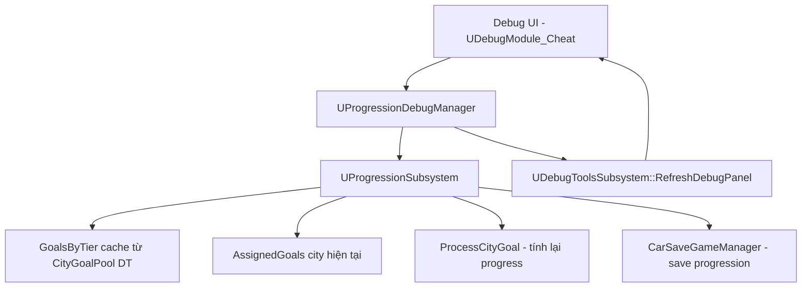
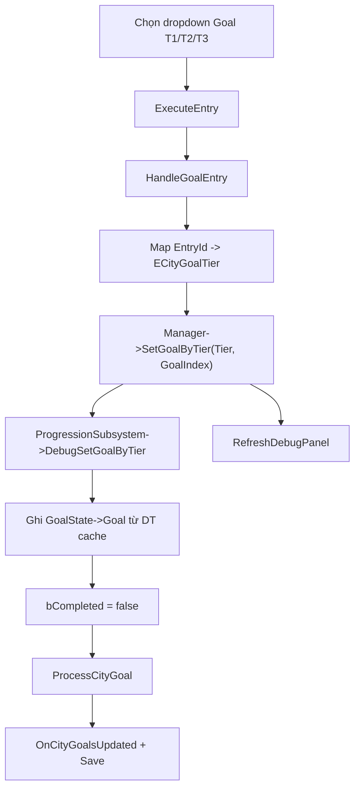

# Debug Goal Config Flow

## Mục Tiêu

Tính năng **Goal Config** trong debug cheat dùng để QC/dev **chọn goal cụ thể từ DataTable** (theo tier T1/T2/T3) và gán vào city hiện tại, mà không cần chơi đủ flow progression hoặc chờ random assign goal.

Debug UI chỉ đóng vai trò trung gian:

- Hiển thị danh sách goal theo tier từ `CityGoalPool` DataTable.
- Cho phép chọn goal qua dropdown `Goal T1` / `Goal T2` / `Goal T3`.
- Gọi sang `UProgressionDebugManager` → `UProgressionSubsystem` để ghi goal definition vào save.
- Sau khi đổi goal, gọi `ProcessCityGoal` để **tính lại progress/completed** từ dữ liệu progression chung (wins, tracks, CR...), không reset progress về 0 một cách mù quáng.
- Refresh debug panel để UI sync lại option đang chọn.

Debug **không tự random goal**. Goal definition lấy đúng row DataTable theo index user chọn. Logic tính completed/progress đi qua `ProcessCityGoal` giống flow game thật.

Nhóm **Goals** (toggle T1/T2/T3, Reset Goal, Reload) là tính năng debug goal liên quan nhưng **khác** Goal Config: toggle chỉ đánh dấu completed; Reset/Reload xử lý toàn bộ goal city; Goal Config chỉ **swap definition** từng tier.

## Sản Phẩm Cuối

Trong cheat debug, nhóm `City&Progression` có nested group **Goal Config** với các control:

```text
Goal T1   (dropdown)
Goal T2   (dropdown)
Goal T3   (dropdown)
```

Cùng nhóm `Goals` (cùng section City&Progression):

```text
T1 / T2 / T3   (toggle completed)
Reset Goal
Reload
Reset
Unlock All
```

Entry id chính cho Goal Config:

```cpp
CheatGoalSelectT1
CheatGoalSelectT2
CheatGoalSelectT3
```

Kết quả mong đợi:

- Mở debug panel → dropdown hiển thị toàn bộ goal của tier từ DT.
- Goal đang assign trên city hiện tại có hậu tố `(Current)` trong tên option.
- Dropdown trỏ đúng dòng đang chọn (qua `GetCurrentValues`).
- Chọn goal mới → ghi vào `AssignedGoals[tier]` của city hiện tại → `ProcessCityGoal` → save progression.
- Nếu city đã đủ điều kiện goal mới (ví dụ đổi từ "win 10" sang "win 3"), goal có thể **completed ngay** sau re-evaluate.
- `RefreshDebugPanel` chạy lại sau khi set goal thành công.

**Lưu ý:** Goal Config **không lưu option dropdown** vào `DebugSaveGame`. Trạng thái dropdown luôn đọc từ progression save (`AssignedGoals`).

## Cấu Trúc Tổng Quan



## Flow Build UI

Entry point:

```cpp
UDebugModule_Cheat::GetEntries()
```

File:

```text
PrototypeRacing/Source/PrototypeRacing/Private/DebugSystem/Modules/DebugModule_Cheat.cpp
```

Flow:

```text
GetEntries()
-> lấy UProgressionDebugManager
-> build nested group City&Progression
   -> group Goals (toggle + Reset/Reload/...)
   -> group Goal Config
      -> CreateOptionDropdown(GoalT1)
      -> CreateOptionDropdown(GoalT2)
      -> CreateOptionDropdown(GoalT3)
```

Dropdown builder dùng chung:

```text
ECheatDropdownOptionSet::GoalT1 / GoalT2 / GoalT3
-> BuildDropdownOptions()
-> BuildGoalDropdownOptions(Manager, Tier)
-> Manager->DebugGetGoalsByTier(Tier)
-> Manager->GetCurrentGoalIndexByTier(Tier)  // để gắn (Current)
```

Helper UI:

```cpp
MakeCurrentLabel()           // thêm hậu tố (Current)
CreateOptionDropdown()       // wrap MakeDropdown + BuildDropdownOptions
```

## Flow Sync UI — GetCurrentValues

Blueprint widget gọi:

```cpp
UDebugToolsSubsystem::GetCurrentValuesForCategory("Cheat")
-> UDebugModule_Cheat::GetCurrentValues()
```

Goal dropdown cần `GetCurrentValues` vì `GetEntries` chỉ build **danh sách option** (`DropBoxItems`), không set `CurrentValue` cho widget.

Flow:

```text
GetCurrentValues()
-> SyncPendingCarCRValues()        // slider CR (không liên quan goal)
-> AppendGoalDropdownValues()
   -> FindCurrentGoalIndex(Manager, Tier)
   -> CurrentValues["CheatGoalSelectT1"] = index
   -> CurrentValues["CheatGoalSelectT2"] = index
   -> CurrentValues["CheatGoalSelectT3"] = index
```

Gọi khi:

```text
RefreshDebugPanel()
-> PopulateCategory()
-> GetEntries() + GetCurrentValues()
```

Trigger `RefreshDebugPanel` sau `SetGoalByTier` thành công, jump city, reset goal, v.v.

## Flow Chọn Goal (Set Goal)

Entry:

```cpp
UDebugModule_Cheat::ExecuteEntry(...)
-> HandleGoalEntry(EntryId, Value, GI)
```

Khi user chọn dropdown:

```text
EntryId = CheatGoalSelectT1 | T2 | T3
Value   = GoalIndex (0, 1, 2...) = FDropBoxItem.ID
```

Sơ đồ:



### HandleGoalEntry

```cpp
const int32 GoalIndex = FMath::RoundToInt(Value.GetValue<float>());
return Manager->SetGoalByTier(*GoalTier, GoalIndex);
```

Cheat module **không** gọi `ProgressionSubsystem` trực tiếp cho set goal — đi qua `ProgressionDebugManager`.

## Flow Trong ProgressionDebugManager

### GetCurrentGoalIndexByTier

Dùng để biết dropdown đang chọn dòng nào và gắn label `(Current)`.

```text
GetCurrentGoalIndexByTier(Tier)
-> DebugGetGoalsByTier(Tier)              // list từ DT cache
-> DebugGetCurrentCityGoals()             // AssignedGoals city hiện tại
-> lọc slot đúng tier
-> so khớp với từng row DT:
   - GoalId (nếu có)
   - hoặc Tier + GoalType + TargetValue + TargetCarRatingLevel
-> return index trong list DT
```

### SetGoalByTier

```cpp
bool UProgressionDebugManager::SetGoalByTier(ECityGoalTier Tier, int32 GoalIndex) const
{
    ProgressionSubsystem->DebugSetGoalByTier(Tier, GoalIndex);
    DebugTools->RefreshDebugPanel();
}
```

## Flow Trong ProgressionSubsystem

### Cache goal từ DataTable

Khi setup:

```cpp
UProgressionSubsystem::SetupCityGoalPoolTable(InCityGoalPoolTable)
-> GoalsByTier[Tier].Add(FCityGoal row)
```

Public debug wrapper:

```cpp
DebugGetGoalsByTier(Tier) -> GetGoalsByTier(Tier)
```

### DebugSetGoalByTier

```cpp
bool UProgressionSubsystem::DebugSetGoalByTier(ECityGoalTier Tier, int32 GoalIndex)
```

Flow:

```text
DebugSetGoalByTier()
-> validate GoalIndex trong GetGoalsByTier(Tier)
-> GetCurrentCityProgress()
-> tìm FCityAssignedGoalState đúng tier trong AssignedGoals
-> GoalState->Goal = CandidateGoals[GoalIndex]
-> GoalState->bCompleted = false
-> ProcessCityGoal(*GoalState, *CurrentCity)
-> OnCityGoalsUpdated.Broadcast
-> SaveProgressionData
```

**Không random lại.** Lấy đúng definition từ DT theo index.

**Không reset CurrentValue về 0 cứng.** `ProcessCityGoal` đọc lại từ progression data và set `CurrentValue` + `bCompleted` theo goal mới.

### DebugGetCurrentCityGoals

```text
tìm city có CityIndex == CurrentCityPosition
-> return CityUnlockData.AssignedGoals
```

## ProcessCityGoal — Tại Sao Cần

Sau khi swap goal definition, hệ thống cần đồng bộ progress với data thật:

```text
Ví dụ:
- Goal cũ: win 10 races (đang 7/10)
- Đổi sang: win 3 races
- ProcessCityGoal đọc wins hiện có = 7
-> goal mới: 7/3, bCompleted = true
```

Đây là lý do thiết kế **chỉ đổi definition**, không xóa progression city.

## Các Nút Goal Liên Quan (Không Phải Goal Config)

| Entry | Hành vi |
|-------|---------|
| `CheatGoalT1/T2/T3` toggle | `DebugSetCurrentCityGoalTierCompleted` — chỉ đánh dấu completed |
| `CheatResetGoal` | `ResetGoal()` — set all goals city hiện tại `bCompleted = false` |
| `CheatReloadGoals` | `ReloadGoals()` → `DebugReloadGoals()` — random assign lại goal cho city |

Goal Config **khác** Reload: Reload gọi `AssignGoalsToCityUnlockData` (random từ pool), Goal Config pick **một row cụ thể** từ DT.

## Các File Liên Quan

```text
PrototypeRacing/Source/PrototypeRacing/Private/DebugSystem/Modules/DebugModule_Cheat.cpp
PrototypeRacing/Source/PrototypeRacing/Public/DebugSystem/Modules/DebugModule_Cheat.h
PrototypeRacing/Source/PrototypeRacing/Private/DebugSystem/ProgressionDebugManager.cpp
PrototypeRacing/Source/PrototypeRacing/Public/DebugSystem/ProgressionDebugManager.h
PrototypeRacing/Source/PrototypeRacing/Private/BackendSubsystem/Progression/ProgressionSubsystem.cpp
PrototypeRacing/Source/PrototypeRacing/Public/BackendSubsystem/Progression/ProgressionSubsystem.h
PrototypeRacing/Source/PrototypeRacing/Private/DebugSystem/DebugToolsSubsystem.cpp
```

## Phần Code Debug Cần Đọc

### 1. Dropdown Builder (anonymous namespace)

File:

```text
PrototypeRacing/Source/PrototypeRacing/Private/DebugSystem/Modules/DebugModule_Cheat.cpp
```

```cpp
enum class ECheatDropdownOptionSet : uint8
{
    Garage,
    GoalT1,
    GoalT2,
    GoalT3,
};

static TArray<FDropBoxItem> BuildGoalDropdownOptions(const UProgressionDebugManager* Manager, ECityGoalTier Tier);
static TArray<FDropBoxItem> BuildDropdownOptions(ECheatDropdownOptionSet OptionSet, UProgressionDebugManager* Manager);
static void AppendGoalDropdownValues(TMap<FName, float>& CurrentValues, const UProgressionDebugManager* Manager);
```

Ý nghĩa:

```text
BuildGoalDropdownOptions   -> list option + (Current) label
BuildDropdownOptions       -> switch GoalT1/T2/T3/Garage
AppendGoalDropdownValues   -> sync index dropdown trong GetCurrentValues
```

### 2. Build UI Goal Config

Hàm:

```cpp
UDebugModule_Cheat::GetEntries()
```

Đoạn liên quan:

```cpp
TArray<FProgressionBox> ItemsGoalConfig;
if (Manager)
{
    ItemsGoalConfig.Add(CreateOptionDropdown(ECheatDropdownOptionSet::GoalT1, FName(TEXT("CheatGoalSelectT1")), ...));
    ItemsGoalConfig.Add(CreateOptionDropdown(ECheatDropdownOptionSet::GoalT2, FName(TEXT("CheatGoalSelectT2")), ...));
    ItemsGoalConfig.Add(CreateOptionDropdown(ECheatDropdownOptionSet::GoalT3, FName(TEXT("CheatGoalSelectT3")), ...));
}

GroupsCityProgression.Add(MakeProgressionGroup(FName(TEXT("GoalConfig")), FText::FromString(TEXT("Goal Config")), ItemsGoalConfig));
```

### 3. Xử Lý Khi Chọn Dropdown

Hàm:

```cpp
UDebugModule_Cheat::HandleGoalEntry(FName EntryId, const FVariant& Value, UGameInstance* GI) const
```

Entry id:

```cpp
CheatGoalSelectT1 -> ECityGoalTier::Tier1
CheatGoalSelectT2 -> ECityGoalTier::Tier2
CheatGoalSelectT3 -> ECityGoalTier::Tier3
```

Khi chọn goal:

```cpp
const int32 GoalIndex = FMath::RoundToInt(Value.GetValue<float>());
return Manager->SetGoalByTier(*GoalTier, GoalIndex);
```

`GoalIndex` = `FDropBoxItem.ID` trong list tier đó (0-based index trong DT cache).

### 4. GetCurrentValues — Sync Dropdown

Hàm:

```cpp
UDebugModule_Cheat::GetCurrentValues() const
```

```cpp
AppendGoalDropdownValues(CurrentValues, Manager);
```

Map trả về:

```text
CheatGoalSelectT1 -> float index goal T1 hiện tại
CheatGoalSelectT2 -> float index goal T2 hiện tại
CheatGoalSelectT3 -> float index goal T3 hiện tại
```

Chỉ dùng cho **sync UI**, không dùng để set goal.

### 5. ProgressionDebugManager API

File:

```text
PrototypeRacing/Source/PrototypeRacing/Public/DebugSystem/ProgressionDebugManager.h
```

```cpp
TArray<FCityGoal> DebugGetGoalsByTier(ECityGoalTier Tier) const;
TArray<FCityAssignedGoalState> DebugGetCurrentCityGoals() const;
int32 GetCurrentGoalIndexByTier(ECityGoalTier Tier) const;
bool SetGoalByTier(ECityGoalTier Tier, int32 GoalIndex) const;
```

Bridge pattern: Cheat → Manager → Subsystem.

### 6. ProgressionSubsystem Debug API

File:

```text
PrototypeRacing/Source/PrototypeRacing/Public/BackendSubsystem/Progression/ProgressionSubsystem.h
```

```cpp
TArray<FCityAssignedGoalState> DebugGetCurrentCityGoals() const;
bool DebugSetGoalByTier(ECityGoalTier Tier, int32 GoalIndex);
TArray<FCityGoal> DebugGetGoalsByTier(ECityGoalTier Tier) const;
bool DebugReloadGoals();
bool DebugSetCurrentCityGoalTierCompleted(ECityGoalTier GoalTier, bool bCompleted);
```

`DebugGetGoalsByTier` là public wrapper vì `GetGoalsByTier` private.

### 7. DebugSetGoalByTier — Logic Ghi Goal

```cpp
GoalState->Goal = (*CandidateGoals)[GoalIndex];
GoalState->bCompleted = false;
ProcessCityGoal(*GoalState, *CurrentCity);
OnCityGoalsUpdated.Broadcast(*GoalState);
CarSaveGameManager->SaveProgressionData(...);
```

## So Sánh GetEntries vs GetCurrentValues (Goal)

| | `GetEntries` | `GetCurrentValues` |
|--|-------------|-------------------|
| Mục đích | Build UI: label, list option | Sync vị trí dropdown đang chọn |
| Goal | `DropBoxItems` + `(Current)` trên tên | Index (`CheatGoalSelectT1` = 0,1,2...) |
| Set goal? | Không | Không |

## Tóm Tắt

```text
Debug UI chọn goal từ dropdown (T1/T2/T3)
-> HandleGoalEntry -> ProgressionDebugManager::SetGoalByTier
-> ProgressionSubsystem::DebugSetGoalByTier
-> ghi goal definition từ DT vào AssignedGoals
-> ProcessCityGoal tính lại progress/completed từ data chung
-> save progression + RefreshDebugPanel
-> GetCurrentValues sync dropdown index cho UI
```

Goal Config giúp QC test nhanh các goal definition khác nhau trên city hiện tại mà vẫn giữ progression data thật và dùng cùng logic evaluate goal với game.
