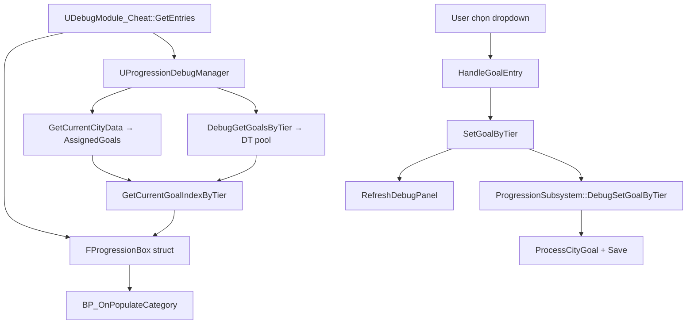

# Debug Goal Config Flow

## Mục Tiêu

Tính năng **Goal Config** trong debug cheat cho phép QC/dev **chọn goal cụ thể từ DataTable `CityGoalPool`** (theo tier T1/T2/T3) và gán vào city hiện tại, không cần chờ random assign hay chơi đủ flow progression.

Debug UI đóng vai trò trung gian:

- Hiển thị danh sách goal theo tier từ DT pool.
- Đánh dấu goal đang assign trên city hiện tại (label `"Current - ..."`, giống Garage).
- Cho phép chọn goal qua dropdown `Goal T1` / `Goal T2` / `Goal T3`.
- Gọi `UProgressionDebugManager` → `UProgressionSubsystem` để ghi goal definition vào progression.
- Sau khi đổi goal, gọi `ProcessCityGoal` để tính lại progress/completed từ dữ liệu progression thật.
- `RefreshDebugPanel` để UI sync lại sau khi set goal.

Debug **không random goal** khi user chọn từ dropdown. Goal definition lấy đúng row DT theo index user chọn.

Nhóm **Goals** (toggle T1/T2/T3, Reset Goal, Reload) là tính năng liên quan nhưng **khác** Goal Config:

| Nhóm | Mục đích |
|------|----------|
| **Goals** | Toggle completed, reset/reload toàn bộ goal city |
| **Goal Config** | Swap definition từng tier từ DT |

---

## UI Trong Cheat Panel

Section `City&Progression` → nested group **Goal Config**:

```text
Goal T1   (dropdown)   EntryId: CheatGoalSelectT1
Goal T2   (dropdown)   EntryId: CheatGoalSelectT2
Goal T3   (dropdown)   EntryId: CheatGoalSelectT3
```

Kết quả mong đợi:

- Dropdown hiển thị toàn bộ goal của tier từ DT.
- Goal đang assign có prefix **`Current - `** trên tên option (giống Garage).
- Combobox chọn sẵn đúng dòng (nhờ `FProgressionBox.CurrentValue`).
- Chọn goal mới → ghi `AssignedGoals[tier]` → `ProcessCityGoal` → save → refresh panel.

**Lưu ý:** Dropdown index **không lưu** vào `DebugSaveGame`. Current luôn **tính lại** từ goal city runtime so với DT pool khi build UI.

---

## Cấu Trúc Tổng Quan



---

## Struct Dropdown — Data Truyền Vào Widget

Dropdown **không tự query** progression. Widget nhận data qua struct `FDebugEntry` → nested `FProgressionGroup` → `FProgressionBox`.

```text
FDebugEntry (Nested: City&Progression)
  └── ProgressionGroups[] → Goal Config
        └── Items[] → FProgressionBox
              • ID              = CheatGoalSelectT1 / T2 / T3
              • ItemsEntry      = Dropdown
              • DropBoxItems[]  = danh sách option
              • CurrentValue    = index dòng đang chọn (float)
```

### `FDropBoxItem` — từng option trong list

| Field | Ý nghĩa |
|-------|---------|
| `ID` | Index trong pool tier (0, 1, 2...) — **cùng số** với vòng lặp build list |
| `DisplayName` | Tên hiển thị; dòng current có prefix `"Current - "` |

### `CurrentValue` vs `FDropBoxItem.ID`

Cùng là **index trong pool**, nhưng vai trò khác:

| | `DropBoxItems[].ID` | `FProgressionBox.CurrentValue` |
|--|---------------------|-------------------------------|
| Mục đích | Định danh **từng dòng** trong list | Báo widget **dòng nào đang selected** khi mở panel |
| Khi user chọn | `ExecuteEntry` nhận `Value = ID` | Không dùng |
| Khi build UI | Gán trong vòng lặp `BuildGoalDropdownOptions` | Gán trong `CreateOptionDropdown` |

```text
Ví dụ pool T1 có 4 goal, city đang assign goal index 2:

DropBoxItems[2].ID = 2
DropBoxItems[2].DisplayName = "Current - Clear All Medium Tracks"
CurrentValue = 2.0  → combobox hiển thị dòng đó khi đóng
```

### Luồng truyền struct

```text
PopulateCategory("Cheat")
  → GetEntriesForCategory()
  → BP_OnPopulateCategory(Entries)    // chỉ struct, không merge save
```

Blueprint đọc `FProgressionBox.DropBoxItems` (options) và `FProgressionBox.CurrentValue` (selected index).

`GetCurrentValues()` là **kênh phụ** (map `CheatGoalSelectT1` → index) nếu widget gọi `GetCurrentValuesForCategory("Cheat")` — không bắt buộc sau khi `CurrentValue` đã set trên struct.

---

## Xác Định Goal Current

### Nguồn dữ liệu

| Nguồn | API | Vai trò |
|-------|-----|---------|
| **City runtime** | `GetCurrentCityData()` → `CityUnlockData.AssignedGoals` | Goal **đang assign** trên city hiện tại |
| **DT pool** | `DebugGetGoalsByTier(Tier)` | **List option** dropdown |

**Không** đọc save file trực tiếp. `GetCurrentCityData` lấy city trong memory (`CurrentCityPosition`).

### `GetCurrentGoalIndexByTier`

File: `ProgressionDebugManager.cpp`

```text
GetCurrentGoalIndexByTier(Tier)
  → DebugGetGoalsByTier(Tier)           // pool DT
  → GetCurrentCityData(CurrentCity)     // city hiện tại
  → tìm AssignedGoals slot đúng tier
  → so AssignedGoal.Goal với từng row pool
  → return index (0,1,2...) hoặc INDEX_NONE
```

Thứ tự match (fallback trong cùng hàm):

1. `GoalId` khớp (nếu cả hai `!= None`)
2. Full definition: `Tier + GoalType + TargetValue + TargetCarRatingLevel`
3. `GoalType + TargetValue`
4. `GoalType` — chỉ khi **duy nhất** trong pool tier đó
5. `Name` — `FText::EqualTo` nếu cả hai không empty

### `GoalId` trong DT

Field `FCityGoal.GoalId` **khác** `Row Name` trong DataTable. DT hiện tại có thể toàn `GoalId = None` → bước 1 bỏ qua, match dựa vào các bước sau.

`FDropBoxItem.ID` là **index pool** (0,1,2...), không phải `GoalId`.

### So với Garage

| | Garage | Goal Config |
|--|--------|-------------|
| List | Xe trong garage (`ProfileCarConfigurations`) | Row DT (`GoalsByTier`) |
| Current | `BaseCarID == CarConfiguration.BaseCarID` | So `AssignedGoal.Goal` vs row pool |
| Label | `"Current - "` prefix lúc build | `"Current - "` prefix lúc build |
| `CurrentValue` | Không set | **Set** trên struct (combobox nested) |

Garage không lệch vì list và current cùng nguồn runtime. Goal Config tách pool (DT) và assigned goal (city) nên cần bước match + fallback.

---

## Flow Build UI

Entry: `UDebugModule_Cheat::GetEntries()`

File: `DebugModule_Cheat.cpp`

```text
GetEntries()
  → UProgressionDebugManager
  → build City&Progression
     → Goal Config
        → CreateOptionDropdown(GoalT1/T2/T3)
           → BuildGoalDropdownOptions()
              → DebugGetGoalsByTier(Tier)        // list
              → GetCurrentGoalIndexByTier(Tier)    // index current
              → MakeCurrentLabel("Current - ...")  // label
           → DropdownItem.CurrentValue = index   // selected
```

### Các hàm liên quan (anonymous namespace)

```cpp
MakeCurrentLabel()              // "Current - %s"
FindCurrentGoalIndex()          // → GetCurrentGoalIndexByTier
BuildGoalDropdownOptions()      // build DropBoxItems + label
BuildDropdownOptions()          // switch GoalT1/T2/T3/Garage
AppendGoalDropdownValues()      // map sync trong GetCurrentValues
```

### `CreateOptionDropdown` (trong `GetEntries`)

Sau `MakeDropdown`, với `GoalT1/T2/T3`:

```cpp
DropdownItem.CurrentValue = static_cast<float>(CurrentGoalIndex);
```

---

## Flow Sync UI — `GetCurrentValues`

```text
GetCurrentValuesForCategory("Cheat")
  → AppendGoalDropdownValues()
     → CheatGoalSelectT1/T2/T3 = float index
```

Kênh backup cho Blueprint. Nguồn chính cho combobox nested: **`FProgressionBox.CurrentValue`** trong struct từ `GetEntries`.

`RefreshDebugPanel` → `PopulateCategory` → `GetEntries()` (build lại struct + current).

---

## Flow Chọn Goal (Set Goal)

```text
User chọn dropdown
  → ExecuteEntry(EntryId, Value)
  → HandleGoalEntry
  → EntryId = CheatGoalSelectT1/T2/T3
  → Value = FDropBoxItem.ID = GoalIndex
  → SetGoalByTier(Tier, GoalIndex)
  → DebugSetGoalByTier
  → GoalState->Goal = pool[GoalIndex]
  → ProcessCityGoal → Save
  → RefreshDebugPanel
```

```cpp
const int32 GoalIndex = FMath::RoundToInt(Value.GetValue<float>());
return Manager->SetGoalByTier(*GoalTier, GoalIndex);
```

---

## Flow Trong ProgressionSubsystem (tham khảo)

### Cache DT

```cpp
SetupCityGoalPoolTable() → GoalsByTier[Tier].Add(FCityGoal row)
DebugGetGoalsByTier(Tier) → wrapper public
```

### `DebugSetGoalByTier`

```text
validate GoalIndex
→ GoalState->Goal = CandidateGoals[GoalIndex]
→ bCompleted = false
→ ProcessCityGoal (tính lại progress, không reset cứng về 0)
→ SaveProgressionData
```

### `ProcessCityGoal` — ví dụ

```text
Goal cũ: win 10 (đang 7/10)
Đổi sang: win 3
→ ProcessCityGoal đọc wins = 7 → 7/3, completed = true
```

---

## Các Nút Goal Liên Quan

| Entry | Hành vi |
|-------|---------|
| `CheatGoalT1/T2/T3` toggle | `DebugSetCurrentCityGoalTierCompleted` |
| `CheatResetGoal` | Set all goals city `bCompleted = false` |
| `CheatReloadGoals` | Random assign lại goal từ pool |

---

## File Liên Quan

```text
PrototypeRacing/Source/PrototypeRacing/Private/DebugSystem/Modules/DebugModule_Cheat.cpp
PrototypeRacing/Source/PrototypeRacing/Public/DebugSystem/Modules/DebugModule_Cheat.h
PrototypeRacing/Source/PrototypeRacing/Private/DebugSystem/ProgressionDebugManager.cpp
PrototypeRacing/Source/PrototypeRacing/Public/DebugSystem/ProgressionDebugManager.h
PrototypeRacing/Source/PrototypeRacing/Public/DebugSystem/DebugSystemTypes.h
PrototypeRacing/Source/PrototypeRacing/Private/DebugSystem/DebugPanelWidget.cpp
PrototypeRacing/Source/PrototypeRacing/Private/BackendSubsystem/Progression/ProgressionSubsystem.cpp
```

Phần fix current (Garage-style): chỉ **`ProgressionDebugManager.cpp`** (`GetCurrentGoalIndexByTier`) và **`DebugModule_Cheat.cpp`** (`MakeCurrentLabel`, `BuildGoalDropdownOptions`, `CreateOptionDropdown`, `AppendGoalDropdownValues`).

---

## API Debug Goals

### `UProgressionDebugManager`

```cpp
TArray<FCityGoal> DebugGetGoalsByTier(ECityGoalTier Tier) const;
TArray<FCityAssignedGoalState> DebugGetCurrentCityGoals() const;
int32 GetCurrentGoalIndexByTier(ECityGoalTier Tier) const;
bool SetGoalByTier(ECityGoalTier Tier, int32 GoalIndex) const;
bool GetCurrentCityData(FCityProgress& OutCityProgress) const;
```

### `UProgressionSubsystem` (debug)

```cpp
TArray<FCityAssignedGoalState> DebugGetCurrentCityGoals() const;
bool DebugSetGoalByTier(ECityGoalTier Tier, int32 GoalIndex);
TArray<FCityGoal> DebugGetGoalsByTier(ECityGoalTier Tier) const;
bool DebugReloadGoals();
```

---

## Troubleshooting

### Dropdown không có `"Current - "` / combobox sai dòng

1. `GetCurrentGoalIndexByTier` trả `INDEX_NONE` — goal city không map được row DT.
2. Workaround tạm: **Goals → Reload** hoặc chọn goal một lần từ dropdown (ghi definition từ DT).
3. Kiểm tra assigned goal vs DT: `GoalType`, `TargetValue`, `Name`.

### Android vs iOS

Cùng code C++. Khác biệt thường do **save/state** trên từng máy, không phải logic platform. Sau fix fallback match + `CurrentValue` trên struct, cả hai platform dùng cùng flow.

### Log (nếu có)

```bash
adb logcat -s UE | findstr GoalConfig
```

---

## Tóm Tắt

```text
Build UI (GetEntries)
  → pool từ DT (DropBoxItems)
  → current từ city AssignedGoals (GetCurrentGoalIndexByTier)
  → label "Current - " + CurrentValue = index trên FProgressionBox
  → BP_OnPopulateCategory nhận struct

User chọn goal
  → Value = FDropBoxItem.ID (index pool)
  → DebugSetGoalByTier → ProcessCityGoal → Save → RefreshDebugPanel
```

Goal Config giúp QC test nhanh các goal definition trên city hiện tại, giữ progression data thật và dùng cùng logic evaluate goal với game.
