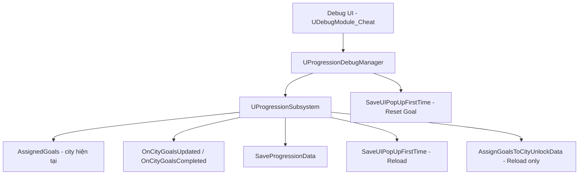
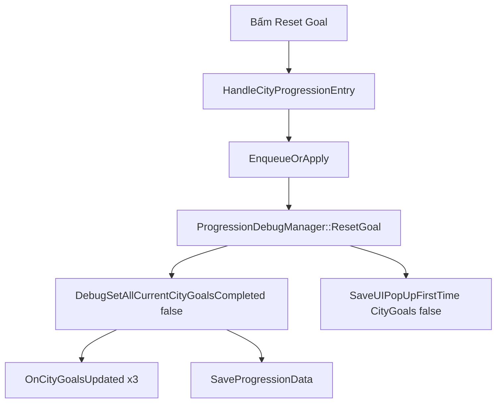
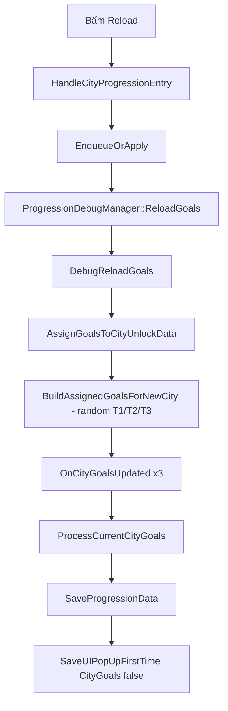

[Tài liệu_DebugResetReloadGoal.md](https://github.com/user-attachments/files/28863583/Tai.li.u_DebugResetReloadGoal.md)
# Debug Reset Goal / Reload Goals Flow

## Mục Tiêu

Tính năng `Reset Goal` và `Reload` trong debug cheat dùng để QC/dev test nhanh city goals mà không cần chơi lại flow unlock city hoặc hoàn thành goal thật.

Debug UI chỉ đóng vai trò trung gian:

- Hiển thị toggle T1/T2/T3 để mark goal completed.
- Có nút `Reset Goal` để đưa 3 goal hiện tại về trạng thái **uncompleted** (không reset tiến trình đếm của goal).
- Có nút `Reload` để reroll bộ goal mới (T1/T2/T3) từ goal pool.
- Gọi sang `UProgressionSubsystem` để chạy logic progression thật.
- Reset flag popup `CityGoals` để UI có thể hiện lại popup giới thiệu goal.

Debug không tự random goal. Random goal, sync progress, save progression đều đi qua `UProgressionSubsystem`.

## Sản Phẩm Cuối

Trong cheat debug, nhóm `City Progression > Goals` có các control:

```text
T1 (toggle)
T2 (toggle)
T3 (toggle)
Reset Goal
Reload
Reset          (reset city progression — khác Reset Goal)
Unlock All
```

Kết quả mong đợi:

- Bấm `Reset Goal` sẽ giữ nguyên 3 goal hiện tại và **tiến trình goal** (`CurrentValue`), chỉ đưa `bCompleted = false`.
- Bấm `Reload` sẽ random lại 3 goal mới (mỗi tier 1 goal) từ `CityGoalDataTable`, rồi sync progress với trạng thái player hiện tại.
- Cả hai nút đều gọi `SaveUIPopUpFirstTime` với `UIName = "CityGoals"`, `bPopUp = false`, `CityId = 1` để popup CityGoals có thể hiện lại.
- Progression data được lưu sau khi thao tác.

## So Sánh Reset Goal vs Reload

| Hành vi | Reset Goal | Reload |
|---------|------------|--------|
| Giữ goal cũ (T1/T2/T3) | Có | Không — reroll mới |
| Đưa `bCompleted` về `false` | Có | Có (goal mới bắt đầu uncompleted) |
| Reset `CurrentValue` (tiến trình đếm) | **Không** — giữ nguyên | Có (goal mới bắt đầu từ 0, rồi sync lại qua `ProcessCurrentCityGoals`) |
| Random từ goal pool | Không | Có |
| `ProcessCurrentCityGoals()` | Không | Có |
| `SaveUIPopUpFirstTime` | Có | Có |

## Cấu Trúc Tổng Quan



## Flow Build UI

Entry point:

```cpp
UDebugModule_Cheat::GetEntries()
```

File:

```text
PrototypeRacing/Source/PrototypeRacing/Private/DebugSystem/Modules/DebugModule_Cheat.cpp
```

Flow:

```text
GetEntries()
-> lấy GameInstance
-> lấy UProgressionSubsystem
-> build toggle T1 / T2 / T3 theo trạng thái completed
-> build button Reset Goal
-> build button Reload
-> build button Reset (city progression)
-> build button Unlock All
```

Các entry chính:

```cpp
CheatGoalT1
CheatGoalT2
CheatGoalT3
CheatResetGoal
CheatReloadGoals
CheatResetCityProgression
CheatUnlockAll
```

Đoạn build UI:

```cpp
ItemsGoals.Add(MakeProgressionToggle(FName(TEXT("CheatGoalT1")), FText::FromString(TEXT("T1")), IsGoalTierCompleted(ECityGoalTier::Tier1)));
ItemsGoals.Add(MakeProgressionToggle(FName(TEXT("CheatGoalT2")), FText::FromString(TEXT("T2")), IsGoalTierCompleted(ECityGoalTier::Tier2)));
ItemsGoals.Add(MakeProgressionToggle(FName(TEXT("CheatGoalT3")), FText::FromString(TEXT("T3")), IsGoalTierCompleted(ECityGoalTier::Tier3)));
ItemsGoals.Add({ TEXT("CheatResetGoal"), FText::FromString(TEXT("Reset Goal")), EDebugEntryType::Button });
ItemsGoals.Add({ TEXT("CheatReloadGoals"), FText::FromString(TEXT("Reload")), EDebugEntryType::Button });
```

## Flow Bấm Reset Goal

Entry:

```cpp
UDebugModule_Cheat::HandleCityProgressionEntry(...)
```

Khi `EntryId == CheatResetGoal`:

```text
DebugModuleCheatPending::EnqueueOrApply(...)
-> UProgressionDebugManager::ResetGoal()
-> UProgressionSubsystem::DebugSetAllCurrentCityGoalsCompleted(false)
-> UCarSaveGameManager::SaveUIPopUpFirstTime(SaveName, 1, "CityGoals", false)
```

Sơ đồ:



## Flow Bấm Reload

Khi `EntryId == CheatReloadGoals`:

```text
DebugModuleCheatPending::EnqueueOrApply(...)
-> UProgressionDebugManager::ReloadGoals()
-> UProgressionSubsystem::DebugReloadGoals()
```

Sơ đồ:



## Flow Trong ProgressionDebugManager

File:

```text
PrototypeRacing/Source/PrototypeRacing/Private/DebugSystem/ProgressionDebugManager.cpp
PrototypeRacing/Source/PrototypeRacing/Public/DebugSystem/ProgressionDebugManager.h
```

### ResetGoal

```cpp
void UProgressionDebugManager::ResetGoal()
{
    if (!ProgressionSubsystem)
    {
        return;
    }
    ProgressionSubsystem->DebugSetAllCurrentCityGoalsCompleted(false);

    if (CarSaveGameManager)
    {
        CarSaveGameManager->SaveUIPopUpFirstTime(
            ProgressionSubsystem->GetSaveName(),
            1,
            TEXT("CityGoals"),
            false);
    }
}
```

Ý nghĩa:

```text
Giữ nguyên 3 goal đang assign cho city hiện tại.
Chỉ đưa về trạng thái uncompleted (bCompleted = false).
Không reset tiến trình goal (CurrentValue vẫn giữ nguyên).
Reset popup flag CityGoals để UI có thể show lại.
CityId hardcode = 1 theo yêu cầu debug.
```

### ReloadGoals

```cpp
void UProgressionDebugManager::ReloadGoals()
{
    if (!ProgressionSubsystem)
    {
        return;
    }
    ProgressionSubsystem->DebugReloadGoals();
}
```

`ReloadGoals` là wrapper mỏng — logic chính nằm trong `UProgressionSubsystem::DebugReloadGoals()`.

## Flow Trong ProgressionSubsystem

### DebugSetAllCurrentCityGoalsCompleted(false)

Dùng cho `Reset Goal`:

```text
DebugSetAllCurrentCityGoalsCompleted(false)
-> lấy city hiện tại qua GetCurrentCityProgress()
-> với mỗi AssignedGoal:
   bCompleted = false
   giữ nguyên CurrentValue (tiến trình goal không bị reset)
   broadcast OnCityGoalsUpdated
-> SaveProgressionData
```

**Lưu ý quan trọng — Reset Goal vs tiến trình goal:**

```text
Reset Goal chỉ đưa goal về trạng thái uncompleted.
Nó KHÔNG reset tiến trình đếm của goal đó (CurrentValue).
Ví dụ: goal "thắng 3 race" đang 2/3 và đã bị mark completed bằng cheat
-> sau Reset Goal vẫn là 2/3, chỉ bỏ trạng thái completed.
```

Lưu ý khác: hàm `DebugSetAllCurrentCityGoalsCompleted` cũng được gọi từ `JumpToCity` / `DebugFinalizeGoalsAfterCityJump`. Vì vậy **không** thêm `SaveUIPopUpFirstTime` vào đây — chỉ gọi từ `ResetGoal` để tránh side effect khi jump city.

### DebugReloadGoals

Dùng cho `Reload`:

```cpp
bool UProgressionSubsystem::DebugReloadGoals()
{
#if !UE_BUILD_SHIPPING
    FCityProgress* CurrentCity = GetCurrentCityProgress();
    if (!CurrentCity)
    {
        return false;
    }

    AssignGoalsToCityUnlockData(CurrentCity->CityUnlockData);
    if (CurrentCity->CityUnlockData.AssignedGoals.IsEmpty())
    {
        return false;
    }

    for (const FCityAssignedGoalState& GoalState : CurrentCity->CityUnlockData.AssignedGoals)
    {
        OnCityGoalsUpdated.Broadcast(GoalState);
    }

    ProcessCurrentCityGoals();

    if (CarSaveGameManager)
    {
        CarSaveGameManager->SaveProgressionData(SaveName, VNTourProgressionData);
        CarSaveGameManager->SaveUIPopUpFirstTime(
            SaveName,
            1,
            TEXT("CityGoals"),
            false);
    }
    return true;
#else
    return false;
#endif
}
```

Flow reroll goal:

```text
AssignGoalsToCityUnlockData()
-> BuildAssignedGoalsForNewCity()
-> random 1 goal cho Tier1, Tier2, Tier3 từ GoalsByTier (CityGoalDataTable)
-> gán vào CurrentCity->CityUnlockData.AssignedGoals
```

`ProcessCurrentCityGoals()` sẽ:

```text
đọc progress thật của player (upgrade, win race, v.v.)
cập nhật CurrentValue / bCompleted nếu đủ điều kiện
broadcast OnCityGoalsUpdated / OnCityGoalsCompleted nếu có thay đổi
gọi CheckCityGoalsAndUnlockNextCity nếu tất cả goal completed
```

## Flow SaveUIPopUpFirstTime

Hàm:

```cpp
UCarSaveGameManager::SaveUIPopUpFirstTime(FString SaveName, int32 CityId, FString UIName, bool bPopUp, int UserIndex = 0)
```

Tham số debug dùng:

```text
SaveName  -> ProgressionSubsystem->GetSaveName() (mặc định "ProgressionSystem")
CityId    -> 1 (hardcode)
UIName    -> "CityGoals"
bPopUp    -> false
UserIndex -> 0 (default)
```

Key lưu trong save:

```cpp
const FString KeyName = FString::Printf(TEXT("%s_%d"), *UIName, CityId);
// -> "CityGoals_1"
```

Ý nghĩa:

```text
bPopUp = false -> UI coi như chưa show popup CityGoals.
Khi player vào màn hình goal, LoadUIPopUpFirstTime có thể trigger popup lại.
Pattern tương tự CityUnlock popup khi unlock city mới.
```

So sánh với flow unlock city:

```cpp
// HandleUnlockNextCity — set popup đã show
CarSaveGameManager->SaveUIPopUpFirstTime(SaveName, OutCityProgress->CityIndex, TEXT("CityUnlock"), true);

// Reset Goal / Reload — reset popup CityGoals để show lại
CarSaveGameManager->SaveUIPopUpFirstTime(SaveName, 1, TEXT("CityGoals"), false);
```

## Các File Liên Quan

```text
PrototypeRacing/Source/PrototypeRacing/Private/DebugSystem/Modules/DebugModule_Cheat.cpp
PrototypeRacing/Source/PrototypeRacing/Public/DebugSystem/Modules/DebugModule_Cheat.h
PrototypeRacing/Source/PrototypeRacing/Private/DebugSystem/ProgressionDebugManager.cpp
PrototypeRacing/Source/PrototypeRacing/Public/DebugSystem/ProgressionDebugManager.h
PrototypeRacing/Source/PrototypeRacing/Private/BackendSubsystem/Progression/ProgressionSubsystem.cpp
PrototypeRacing/Source/PrototypeRacing/Public/BackendSubsystem/Progression/ProgressionSubsystem.h
PrototypeRacing/Source/PrototypeRacing/Private/CarCustomizationSystem/CarSaveGameManager.cpp
PrototypeRacing/Source/PrototypeRacing/Public/CarCustomizationSystem/CarSaveGameManager.h
```

## Phần Code Debug Cần Đọc

Phần này chỉ liệt kê code thuộc debug/cheat cho tính năng Reset Goal / Reload. Logic goal thật nằm ở `UProgressionSubsystem`, không nằm trong debug module.

### 1. Khai Báo Trong ProgressionDebugManager

File:

```text
PrototypeRacing/Source/PrototypeRacing/Public/DebugSystem/ProgressionDebugManager.h
```

Code:

```cpp
UFUNCTION(BlueprintCallable, Category = "Debug|Goals")
void ResetGoal();

UFUNCTION(BlueprintCallable, Category = "Debug|Goals")
void ReloadGoals();
```

### 2. Khai Báo Trong ProgressionSubsystem

File:

```text
PrototypeRacing/Source/PrototypeRacing/Public/BackendSubsystem/Progression/ProgressionSubsystem.h
```

Code:

```cpp
UFUNCTION(BlueprintCallable, Category="Progression System|Debug")
bool DebugSetAllCurrentCityGoalsCompleted(bool bCompleted);

UFUNCTION(BlueprintCallable, Category="Progression System|Debug")
bool DebugReloadGoals();
```

### 3. Xử Lý Khi QC Bấm Nút

File:

```text
PrototypeRacing/Source/PrototypeRacing/Private/DebugSystem/Modules/DebugModule_Cheat.cpp
```

Hàm:

```cpp
UDebugModule_Cheat::HandleCityProgressionEntry(...)
```

Khi bấm `Reset Goal`:

```cpp
static const FName ResetGoalEntryId(TEXT("CheatResetGoal"));
if (EntryId == ResetGoalEntryId)
{
    DebugModuleCheatPending::EnqueueOrApply(
        CheatSubsystem,
        TEXT("Reset current city goals"),
        [Manager]()
        {
            Manager->ResetGoal();
        });
    return true;
}
```

Khi bấm `Reload`:

```cpp
static const FName ReloadGoalsEntryId(TEXT("CheatReloadGoals"));
if (EntryId == ReloadGoalsEntryId)
{
    DebugModuleCheatPending::EnqueueOrApply(
        CheatSubsystem,
        TEXT("Reload current city goals"),
        [Manager]()
        {
            Manager->ReloadGoals();
        });
    return true;
}
```

Ý nghĩa:

```text
Cả hai action đều đi qua DebugModuleCheatPending::EnqueueOrApply.
Giúp tránh apply cheat ngay lập tức khi đang trong state không an toàn.
```

### 4. Toggle T1/T2/T3 (Liên Quan)

Cùng nhóm Goals, toggle tier gọi trực tiếp progression subsystem:

```cpp
ProgressionSubsystem->DebugSetCurrentCityGoalTierCompleted(Tier, bToggleValue);
```

Khác với `Reset Goal`:

```text
Toggle T1/T2/T3  -> chỉ đổi 1 tier, có thể set completed = true hoặc false.
Reset Goal       -> uncomplete cả 3 tier, giữ goal cũ và tiến trình CurrentValue.
Reload           -> thay cả 3 goal bằng bộ random mới, reset tiến trình goal mới.
```

## Lưu Ý Khi Test

```text
Reset Goal chỉ uncomplete goal, không reset tiến trình đếm (CurrentValue).
Reload thì reroll goal mới và reset tiến trình goal mới từ 0.
Reload cần GoalsByTier đã được load từ CityGoalDataTable (SetupCityGoalPoolTable).
Nếu goal pool rỗng, DebugReloadGoals return false và AssignedGoals vẫn empty.
Reset Goal / Reload không revoke reward đã nhận từ goal cũ — chấp nhận được cho debug.
Chỉ compile và chạy trong non-shipping build (#if !UE_BUILD_SHIPPING).
Nút "Reset" trong cùng nhóm là ResetCityProgression (jump về city 1) — khác "Reset Goal".
```

## Tóm Tắt

```text
Debug UI bấm Reset Goal / Reload
-> ProgressionDebugManager gọi ProgressionSubsystem
-> Reset Goal: giữ goal cũ + tiến trình, chỉ uncomplete, save progression + reset popup CityGoals
-> Reload: random goal mới, sync progress, save progression + reset popup CityGoals
-> UI đọc AssignedGoals và LoadUIPopUpFirstTime để hiển thị goal + popup
```
