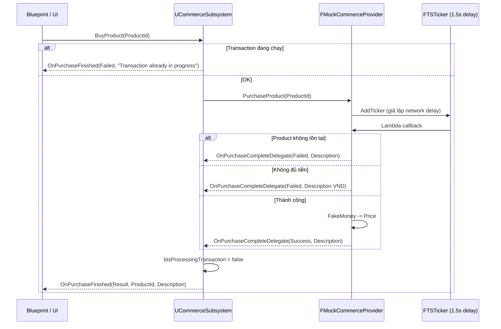
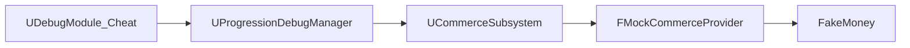

# Mock In-App Purchase (IAP) — Tài liệu kỹ thuật

> **Mục đích:** Mô phỏng flow mua hàng In-App Purchase **trước khi** tích hợp Google Play / App Store và backend xác thực receipt.  
> Hiện tại mọi platform (Editor, Android, iOS) đều dùng `FMockCommerceProvider`.

---

## 1. Tổng quan

Hệ thống chia làm 3 tầng:

| Tầng | Class | Vai trò |
|------|-------|---------|
| **UI / Blueprint** | Bind `UCommerceSubsystem` | Gọi `BuyProduct`, lắng nghe `OnPurchaseFinished` |
| **Orchestration** | `UCommerceSubsystem` | Quản lý provider, chặn transaction trùng, broadcast event ra Blueprint |
| **Provider** | `ICommerceProvider` → `FMockCommerceProvider` | Logic mua hàng giả (số dư, danh sách sản phẩm, delay giả lập) |

**Chưa có:**
- `FAndroidCommerceProvider` / `FIOSCommerceProvider` (đã comment sẵn hook)
- Server verification receipt
- Consume / Acknowledge trên store thật

---

## 2. Sơ đồ luồng

### 2.1 Mua hàng (Purchase)



### 2.2 Debug cheat panel



---

## 3. Cấu trúc file

```
Source/PrototypeRacing/
├── Public/IAPSystem/
│   ├── CommerceTypes.h          # Enum, struct dữ liệu shop
│   ├── CommerceProvider.h       # Interface ICommerceProvider + delegate C++
│   ├── CommerceSubsystem.h      # Subsystem Blueprint-facing
│   ├── MockCommerceProvider.h   # Mock provider
│   └── MockIAP.md               # Tài liệu này
└── Private/IAPSystem/
    ├── CommerceSubsystem.cpp
    └── MockCommerceProvider.cpp

Source/PrototypeRacing/Private/DebugSystem/
├── Modules/DebugModule_Cheat.cpp   # UI cheat group "InApp Purchase"
└── ProgressionDebugManager.cpp   # Bridge debug → CommerceSubsystem
```

---

## 4. Types & Data (`CommerceTypes.h`)

### `ECommerceResult`

```cpp
enum class ECommerceResult : uint8
{
    Success,
    Cancelled,
    Failed,
    Pending
};
```

### `FProductInfo` — sản phẩm mock trong memory

| Field | Kiểu | Mô tả |
|-------|------|-------|
| `ProductId` | `FString` | ID sản phẩm (map với store ID sau này) |
| `Price` | `int32` | Giá theo **đơn vị game** (xem mục 6) |
| `Title` | `FString` | Tên hiển thị |

### `FShopRowInfo` — cấu hình shop trên Data Table (UI / reward)

Dùng cho shop bundle, chưa nối trực tiếp vào mock purchase flow:

- `InAppPurchaseID` — ID trên Google Play / App Store
- `Rewards[]` — phần thưởng trong gói (`FShopReward`)
- `DefaultTitle`, `DescriptionOfBundle`, `PackIcon`

---

## 5. Các class chính

### 5.1 `ICommerceProvider` (`CommerceProvider.h`)

Interface thuần C++ (không phải `UObject`). Provider thật sau này implement interface này.

**Delegate nội bộ (C++):**

```cpp
DECLARE_DELEGATE_TwoParams(FOnQueryComplete, ECommerceResult, const TArray<FProductInfo>&);
DECLARE_DELEGATE_ThreeParams(FOnPurchaseComplete, ECommerceResult, const FString& /*ProductId*/, const FString& /*Description*/);
```

**API bắt buộc:**

| Method | Mô tả |
|--------|-------|
| `Initialize()` | Khởi tạo SDK / mock state |
| `Shutdown()` | Dọn dẹp |
| `QueryProducts(ProductIds)` | Lấy giá/title từ store |
| `PurchaseProduct(ProductId)` | Bắt đầu flow mua |

**Event member:**

```cpp
FOnQueryComplete OnQueryCompleteDelegate;
FOnPurchaseComplete OnPurchaseCompleteDelegate;
```

---

### 5.2 `UCommerceSubsystem` (`CommerceSubsystem.h` / `.cpp`)

`UGameInstanceSubsystem` — điểm vào duy nhất cho Blueprint.

**Blueprint API:**

| Function | Category | Mô tả |
|----------|----------|-------|
| `FetchProducts(ProductIds)` | Commerce | Query sản phẩm qua provider |
| `BuyProduct(ProductId)` | Commerce | Mua sản phẩm |
| `GetFakeMoney()` | InAppPurchase\|Debug | Lấy số dư mock (đơn vị game) |
| `AddFakeMoney(Amount)` | InAppPurchase\|Debug | Cộng/trừ số dư mock |

**Blueprint Events:**

```cpp
FOnCommerceQueryFinished   OnQueryFinished;    // (Result, Products)
FOnCommercePurchaseFinished OnPurchaseFinished; // (Result, ProductId, Description)
```

**Khởi tạo provider** (`CommerceSubsystem.cpp`):

```cpp
#if PLATFORM_ANDROID
    // ActiveProvider = MakeShared<FAndroidCommerceProvider>();
    ActiveProvider = MakeShared<FMockCommerceProvider>();
#elif PLATFORM_IOS
    // ActiveProvider = MakeShared<FIOSCommerceProvider>();
    ActiveProvider = MakeShared<FMockCommerceProvider>();
#else
    ActiveProvider = MakeShared<FMockCommerceProvider>();
#endif

ActiveProvider->OnPurchaseCompleteDelegate.BindUObject(this, &UCommerceSubsystem::HandleProviderPurchaseComplete);
```

**Orchestration mua hàng:**

```cpp
void UCommerceSubsystem::BuyProduct(const FString& ProductId)
{
    if (bIsProcessingTransaction)
    {
        OnPurchaseFinished.Broadcast(ECommerceResult::Failed, ProductId, TEXT("Transaction already in progress"));
        return;
    }
    bIsProcessingTransaction = true;
    ActiveProvider->PurchaseProduct(ProductId);
}
```

**Routing kết quả:**

```cpp
void UCommerceSubsystem::HandleProviderPurchaseComplete(ECommerceResult Result, const FString& ProductId, const FString& Description)
{
    bIsProcessingTransaction = false;
    // TODO: Server verification khi có backend
    OnPurchaseFinished.Broadcast(Result, ProductId, Description);
}
```

---

### 5.3 `FMockCommerceProvider` (`MockCommerceProvider.h` / `.cpp`)

Class C++ mock — giả lập ví và catalog sản phẩm trong RAM.

**State nội bộ:**

```cpp
int FakeMoney = 5000;              // Số dư mặc định (đơn vị game → 5.000.000 VND hiển thị)
TArray<FProductInfo> Products;     // Catalog thêm bằng AddProduct()
```

**API debug-only (không qua interface):**

| Method | Mô tả |
|--------|-------|
| `AddProduct(Product)` | Thêm sản phẩm vào catalog mock |
| `GetProduct(ProductId, OutProduct)` | Tìm sản phẩm, return `bool` |
| `GetFakeMoney()` | Lấy số dư |
| `AddFakeMoney(Amount)` | Cộng/trừ, clamp ≥ 0 |

**Logic mua hàng** — delay 1.5 giây qua `FTSTicker`:

```cpp
void FMockCommerceProvider::PurchaseProduct(const FString& ProductId)
{
    FTSTicker::GetCoreTicker().AddTicker(
        FTickerDelegate::CreateLambda([this, ProductId](float DeltaTime)
        {
            // 1. Tìm product
            // 2. Kiểm tra FakeMoney >= Price
            // 3. Trừ tiền + broadcast Success
            return false; // ticker chạy 1 lần
        }),
        1.5f
    );
}
```

**Các case fail & message:**

| Case | `ECommerceResult` | `Description` (ví dụ) |
|------|-------------------|------------------------|
| Product không tồn tại | `Failed` | `"Không tồn tại sản phẩm..."` |
| Không đủ tiền | `Failed` | `"Số dư... không đủ. Cần tối thiểu X VND..."` |
| Thành công | `Success` | `"Purchase successful"` |

**`QueryProducts`:** hiện **chưa implement** (body rỗng) — cần bổ sung khi mock query catalog.

---

## 6. Quy ước tiền tệ (quan trọng)

Giá trị lưu trong game (`Price`, `FakeMoney`) dùng **đơn vị game** (quy về nghìn đồng):

| Lưu trong code | Hiển thị VND |
|----------------|--------------|
| `350` | `350.000 VND` |
| `5000` | `5.000.000 VND` |

**Công thức hiển thị:** `DisplayVND = GameAmount × 1000`, format dấu `.` mỗi 3 chữ số.

```cpp
FString S = FString::Printf(TEXT("%lld"), static_cast<int64>(Amount) * 1000);
for (int32 i = S.Len() - 3; i > 0; i -= 3)
    S.InsertAt(i, TEXT('.'));
// → "350.000", "5.000.000"
```

> Logic so sánh / trừ tiền vẫn dùng số gốc (`Product.Price > FakeMoney`).  
> Chỉ **message UI / debug text** nhân 1000 khi hiển thị.

---

## 7. Tích hợp Debug Cheat Panel

Chỉ compile khi `!UE_BUILD_SHIPPING`.

### 7.1 `UProgressionDebugManager`

Bridge giữa cheat UI và commerce:

```cpp
int32 UProgressionDebugManager::DebugGetFakeMoney()
{
    return CommerceSubsystem->GetFakeMoney();
}

void UProgressionDebugManager::DebugAddFakeMoney(int32 Amount)
{
    CommerceSubsystem->AddFakeMoney(Amount);
}
```

Khởi tạo dependency trong `Initialize()`:

```cpp
Collection.InitializeDependency<UCommerceSubsystem>();
CommerceSubsystem = GI->GetSubsystem<UCommerceSubsystem>();
```

### 7.2 `UDebugModule_Cheat` — group **InApp Purchase**

| Entry ID | Loại | Chức năng |
|----------|------|-----------|
| `CheatIAPFakeMoneyText` | Text | Hiển thị số dư VND |
| `CheatIAPAdd5000` | Button | +5000 đơn vị game |
| `CheatIAPSub4500` | Button | −4500 đơn vị game (clamp ≥ 0) |

Text số dư format trong `GetTextByEntryId`:

```
Số dư hiện tại trong tài khoản là : 5.000.000 VND
```

Sau bấm +/-, gọi `BroadcastByEntryId` để refresh text.

---

## 8. Hướng dẫn dùng từ Blueprint

### Lấy subsystem

```
Get Game Instance → Get Subsystem (CommerceSubsystem)
```

### Thêm sản phẩm mock (C++ hoặc sau này expose Blueprint)

Hiện `AddProduct` trên `UCommerceSubsystem` là **private** — catalog cần được populate từ C++ test code hoặc mở rộng API sau.

### Mua hàng

```
BuyProduct("product_id_001")
```

### Lắng nghe kết quả

Bind event `OnPurchaseFinished`:

| Pin | Kiểu | Mô tả |
|-----|------|-------|
| `Result` | `ECommerceResult` | Success / Failed / ... |
| `ProductId` | `FString` | ID đã mua |
| `Description` | `FString` | Message chi tiết (lỗi VND, success text, ...) |

---

## 9. Test flow gợi ý (Editor)

1. Mở Debug Panel → tab **CheatCode** → group **In App Purchase**
2. Xem số dư: `Số dư hiện tại trong tài khoản là : 5.000.000 VND` (mặc định `FakeMoney = 5000`)
3. Thêm sản phẩm mock qua C++ (`AddProduct`) với `Price = 350`
4. Gọi `BuyProduct` từ Blueprint
5. Sau ~1.5s nhận `OnPurchaseFinished`
6. Dùng **+5000** / **-4500** trên cheat panel để test số dư

---

## 10. Roadmap tích hợp thật

```
[FMockCommerceProvider]  ← hiện tại (tất cả platform)
        ↓
[FAndroidCommerceProvider] / [FIOSCommerceProvider]  ← uncomment trong CommerceSubsystem.cpp
        ↓
HandleProviderPurchaseComplete → Server verify receipt
        ↓
Consume / Acknowledge trên store
        ↓
Grant reward từ FShopRowInfo.Rewards
```

**Điểm mở rộng đã chuẩn bị:**

- `ICommerceProvider` interface tách biệt platform
- `Description` param trên delegate — truyền lỗi/message lên UI
- `FShopRowInfo` + `InAppPurchaseID` — map product store ↔ reward bundle
- Hook server verification tại `HandleProviderPurchaseComplete` (comment sẵn)

---

## 11. Bảng tra delegate

| Layer | Delegate | Params |
|-------|----------|--------|
| Provider → Subsystem (C++) | `FOnPurchaseComplete` | `Result`, `ProductId`, `Description` |
| Subsystem → Blueprint | `FOnCommercePurchaseFinished` | `Result`, `ProductId`, `Description` |
| Provider → Subsystem (C++) | `FOnQueryComplete` | `Result`, `Products[]` |
| Subsystem → Blueprint | `FOnCommerceQueryFinished` | `Result`, `Products[]` |

---

## 12. Known limitations

- `QueryProducts` chưa có logic mock
- `AddProduct` chưa expose Blueprint/public
- Chưa grant reward sau purchase thành công
- Chưa persist `FakeMoney` (reset mỗi session)
- Provider thật Android/iOS chưa implement

---

*Tài liệu phản ánh trạng thái code tại thư mục `Source/PrototypeRacing/Public/IAPSystem/` và tích hợp debug tại `DebugSystem/`.*
